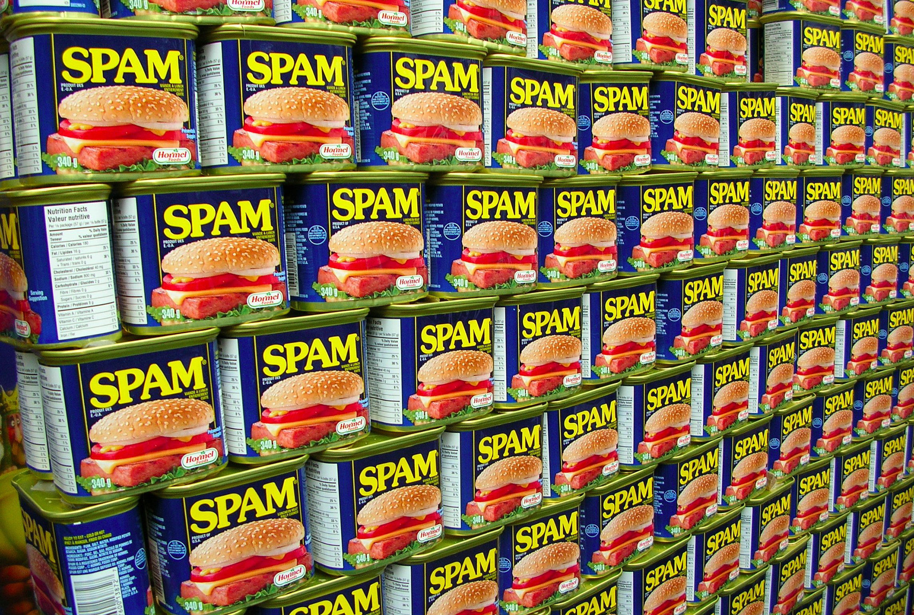

# Natural Language Processing
## with /swɪft/

Ayaka Nonaka
@ayanonagon

---

# SPAM  spam  sp@M  $PAM  spam  sp@m  SP4M  $p@m  sp@M SPAM  spam  sp@M  $PAM  spam  sp@m  SP4M  $p@m  sp@M

---

# Spam
## or
# Ham?

---

URGENT - HELP ME DISTRIBUTE MY $15 MILLION TO CHARITY

IN SUMMARY:- I have 15,000,000.00 (fifteen million) U.S. Dollars and I want you to assist me in distributing the money to charity organizations. I agree to reward you with part of the money for your assistance, kindness and participation in this Godly project. This mail might come to you as a surprise and the temptation to ignore it as unserious could come into your mind but please consider it a divine wish and accept it with a deep sense of humility.

---

See you at Natural Language Processing in Swift with Ayaka Nonaka of Venmo
Swift Language User Group (San Francisco + Silicon Valley)
Invite 1 friend
Simply forward this email to a friend and have them join the Meetup.

---

Forming a new startup and need an iOS developer to partner with and join me on this new, exciting venture. This startup will be the next “big thing” in social media, creating a new way for users to connect with one another, essentially creating its own niche among facebook, twitter and foursquare.
If interested please contact the information below.
XXXX XXXX
XXXXX@XXXXX.XXX
XXX XXX XXXX

---

# Naive Bayes Classifier

---

# Bayes’ theorem

$$
P(A|B) = \frac{P(A)P(B|A)}{P(B)}
$$

---

$$
P(A \cap B) = P(A) P(B|A)
$$

---

$$
P(A \cap B) = P(A) P(B|A)
$$

Probability of :spades: & :a: ?

---

$$
P(A \cap B) = P(A) P(B|A)
$$

Probability of :spades: & :a: ?

`=`

Probability of :spades:
×
Probability of :a: given :spades:

---

$$
P(A \cap B) = P(A) P(B|A)
$$

Probability of :spades: & :a: ?

`=`

Probability of :spades: = 1/4
×
Probability of :a: given :spades:

---

$$
P(A \cap B) = P(A) P(B|A)
$$

Probability of :spades: & :a: ?

`=`

Probability of :spades: = 1/4
×
Probability of :a: given :spades: = 1/13

---

$$
P(A \cap B) = P(A) P(B|A)
$$

Probability of :spades: & :a: ?

`=`

Probability of :spades: = 1/4
×
Probability of :a: given :spades: = 1/13

`=`

1/52

---

$$
P(A \cap B) = P(A) P(B|A)
$$

---

$$
P(A \cap B) = P(A) P(B|A)
$$

$$
P(A \cap B) = P(B) P(A|B)
$$

---

$$
P(A \cap B) = P(A) P(B|A)
$$

$$
P(A \cap B) = P(B) P(A|B)
$$

$$
P(A) P(B|A) = P(B) P(A|B)
$$

---

$$
P(A \cap B) = P(B) P(A|B)
$$

$$
P(A \cap B) = P(A) P(B|A)
$$

$$
P(B) P(A|B) = P(A) P(B|A)
$$

$$
P(A|B) = \frac{P(A) P(B|A)}{P(B)}
$$

---

* 30 emails of a total of 50 are spam
* 20 out of the total 50 contain the word SODIUM
* 15 of the emails that contain the word SODIUM are spam

---

* 30 emails of a total of 50 are spam
* 20 out of the total 50 contain the word SODIUM
* 15 of the emails that contain the word SODIUM are spam

What’s the probability that an email is spam given that it contains the word SODIUM?

---

* 30 emails of a total of 50 are spam
* 20 out of the total 50 contain the word SODIUM
* 15 of the emails that contain the word SODIUM are spam

What’s the probability that an email is spam given that it contains the word SODIUM?

$$
P(spam|SODIUM) = \frac{P(spam) P(SODIUM|spam)}{P(SODIUM)}
$$

$$
= \frac{\frac{30}{50} \frac{15}{30}}{\frac{20}{50}} = 0.75
$$

---

* 30 emails of a total of 50 are spam
* 20 out of the total 50 contain the word SODIUM
* 15 of the emails that contain the word SODIUM are spam

---

* 30 emails of a total of 50 are spam
* 20 out of the total 50 contain the word SODIUM
* 15 of the emails that contain the word SODIUM are spam
* 15 out of the total 50 contain the word CHOLESTEROL
* 10 of the emails that contain the word CHOLESTEROL are spam

---

$$
P(spam|S \cap C)
$$

---

$$
P(spam|S \cap C)
$$

$$
= \frac{P(spam)P(S \cap C|spam)}{P(S \cap C)}
$$

---

$$
P(spam|S \cap C)
$$

$$
= \frac{P(spam)P(S \cap C|spam)}{P(S \cap C)}
$$

$$
= \frac{P(spam)P(S \cap C|spam)}{P(S)P(C|S)}
$$

---

$$
P(spam|S \cap C)
$$

$$
= \frac{P(spam)P(S \cap C|spam)}{P(S \cap C)}
$$

$$
= \frac{P(spam)P(S \cap C|spam)}{P(S)P(C|S)}
$$

$$
= \frac{P(spam)P(S|spam)P(C|spam \cap S)}{P(S)P(C|S)}
$$

---

* 30 emails of a total of 50 are spam
* 20 out of the total 50 contain the word SODIUM
* 15 of the emails that contain the word SODIUM are spam
* 15 out of the total 50 contain the word CHOLESTEROL
* 10 of the emails that contain the word CHOLESTEROL are spam

$$
= \frac{P(spam)P(S|spam)P(C|spam \cap S)}{P(S)P(C|S)}
$$

---

* 30 emails of a total of 50 are spam
* 20 out of the total 50 contain the word SODIUM
* 15 of the emails that contain the word SODIUM are spam
* 15 out of the total 50 contain the word CHOLESTEROL
* 10 of the emails that contain the word CHOLESTEROL are spam

$$
= \frac{\frac{30}{50}P(S|spam)P(C|spam \cap S)}{P(S)P(C|S)}
$$

---

* 30 emails of a total of 50 are spam
* 20 out of the total 50 contain the word SODIUM
* 15 of the emails that contain the word SODIUM are spam
* 15 out of the total 50 contain the word CHOLESTEROL
* 10 of the emails that contain the word CHOLESTEROL are spam

$$
= \frac{\frac{30}{50}\frac{15}{30}P(C|spam \cap S)}{P(S)P(C|S)}
$$

---

* 30 emails of a total of 50 are spam
* 20 out of the total 50 contain the word SODIUM
* 15 of the emails that contain the word SODIUM are spam
* 15 out of the total 50 contain the word CHOLESTEROL
* 10 of the emails that contain the word CHOLESTEROL are spam

$$
= \frac{\frac{30}{50}\frac{15}{30}P(C|spam \cap S)}{\frac{20}{50}P(C|S)}
$$

---

Throw in another word, $$Z$$.

$$
\frac{P(spam)P(S|spam)P(C|spam \cap S)P(Z|spam \cap S \cap C)}{P(S)P(C|S)P(Z|S \cap C)}
$$

---

# *Naive* Bayes Classifier

---

# Naive?

---

# Assume conditional independence!

---

## Assume conditional independence

$$A$$ and $$B$$ are conditionally independent.

$$
P(A|B) = P(A)
$$

---

## Assume conditional independence

$$A$$ and $$B$$ are conditionally independent.

$$
P(A|B \cap C) = P(A|C)
$$

---

* 30 emails of a total of 50 are spam
* 20 out of the total 50 contain the word SODIUM
* 15 of the emails that contain the word SODIUM are spam
* 15 out of the total 50 contain the word CHOLESTEROL
* 10 of the emails that contain the word CHOLESTEROL are spam

$$
= \frac{\frac{30}{50}\frac{15}{30}P(C|spam \cap S)}{\frac{20}{50}P(C|S)}
$$

---

* 30 emails of a total of 50 are spam
* 20 out of the total 50 contain the word SODIUM
* 15 of the emails that contain the word SODIUM are spam
* 15 out of the total 50 contain the word CHOLESTEROL
* 10 of the emails that contain the word CHOLESTEROL are spam

$$
= \frac{\frac{30}{50}\frac{15}{30}P(C|spam)}{\frac{20}{50}P(C|S)}
$$

---

* 30 emails of a total of 50 are spam
* 20 out of the total 50 contain the word SODIUM
* 15 of the emails that contain the word SODIUM are spam
* 15 out of the total 50 contain the word CHOLESTEROL
* 10 of the emails that contain the word CHOLESTEROL are spam

$$
= \frac{\frac{30}{50}\frac{15}{30}P(C|spam)}{\frac{20}{50}P(C)}
$$

---

* 30 emails of a total of 50 are spam
* 20 out of the total 50 contain the word SODIUM
* 15 of the emails that contain the word SODIUM are spam
* 15 out of the total 50 contain the word CHOLESTEROL
* 10 of the emails that contain the word CHOLESTEROL are spam

$$
= \frac{\frac{30}{50}\frac{15}{30}\frac{10}{30}}{\frac{20}{50}P(C)}
$$

---

* 30 emails of a total of 50 are spam
* 20 out of the total 50 contain the word SODIUM
* 15 of the emails that contain the word SODIUM are spam
* 15 out of the total 50 contain the word CHOLESTEROL
* 10 of the emails that contain the word CHOLESTEROL are spam

$$
= \frac{\frac{30}{50}\frac{15}{30}\frac{10}{30}}{\frac{20}{50}\frac{15}{50}}
$$

---

* 30 emails of a total of 50 are spam
* 20 out of the total 50 contain the word SODIUM
* 15 of the emails that contain the word SODIUM are spam
* 15 out of the total 50 contain the word CHOLESTEROL
* 10 of the emails that contain the word CHOLESTEROL are spam

$$
= \frac{\frac{30}{50}\frac{15}{30}\frac{10}{30}}{\frac{20}{50}\frac{15}{50}} \approx 0.83
$$

---

$$
D = {w_1, w_2, ..., w_n}
$$

$$
P(spam|D) = \frac{P(spam) P(w_1|spam) P(w_2|spam) ... P(w_n|spam)}{P(w_1) P(w_2) ... P(w_n)}
$$

---

### $$P(spam|D)$$ vs. $$P(ham|D)$$

---

$$
categorization = argmax_C P(C|D)
$$

---

$$
categorization = argmax_C P(C|D)
$$

$$
= argmax_C \frac{P(C) P(w_1|C) P(w_2|C) ... P(w_n|C)}{P(w_1) P(w_2) ... P(w_n)}
$$

---

$$
categorization = argmax_C P(C|D)
$$

$$
= argmax_C \frac{P(C) P(w_1|C) P(w_2|C) ... P(w_n|C)}{P(w_1) P(w_2) ... P(w_n)}
$$

$$
= argmax_C P(C) P(w_1|C) P(w_2|C) ... P(w_n|C)
$$

---

$$
categorization = argmax_C P(C|D)
$$

$$
= argmax_C \frac{P(C) P(w_1|C) P(w_2|C) ... P(w_n|C)}{P(w_1) P(w_2) ... P(w_n)}
$$

$$
= argmax_C P(C) P(w_1|C) P(w_2|C) ... P(w_n|C)
$$

$$
= argmax_C log(P(C) P(w_1|C) P(w_2|C) ... P(w_n|C))
$$

---

$$
categorization = argmax_C P(C|D)
$$

$$
= argmax_C \frac{P(C) P(w_1|C) P(w_2|C) ... P(w_n|C)}{P(w_1) P(w_2) ... P(w_n)}
$$

$$
= argmax_C P(C) P(w_1|C) P(w_2|C) ... P(w_n|C)
$$

$$
= argmax_C log(P(C) P(w_1|C) P(w_2|C) ... P(w_n|C))
$$

$$
= argmax_C log(P(C)) + log(P(w_1|C)) + log(P(w_2|C)) + log(P(w_n|C))
$$

---

# </MATH>

---

# NSLinguisticTagger

---

# NSLinguisticTagger

* Lemmatization
* Part of speech tagging
* Language detection

---

# Swift Playgrounds

---

# bit.ly/swiftnbc
### (Swift 1.2)

---

# NLTK
## nltk.org

---

# Parsimmon
## github.com/ayanonagon/Parsimmon

---

# ???
### @ayanonagon

---
