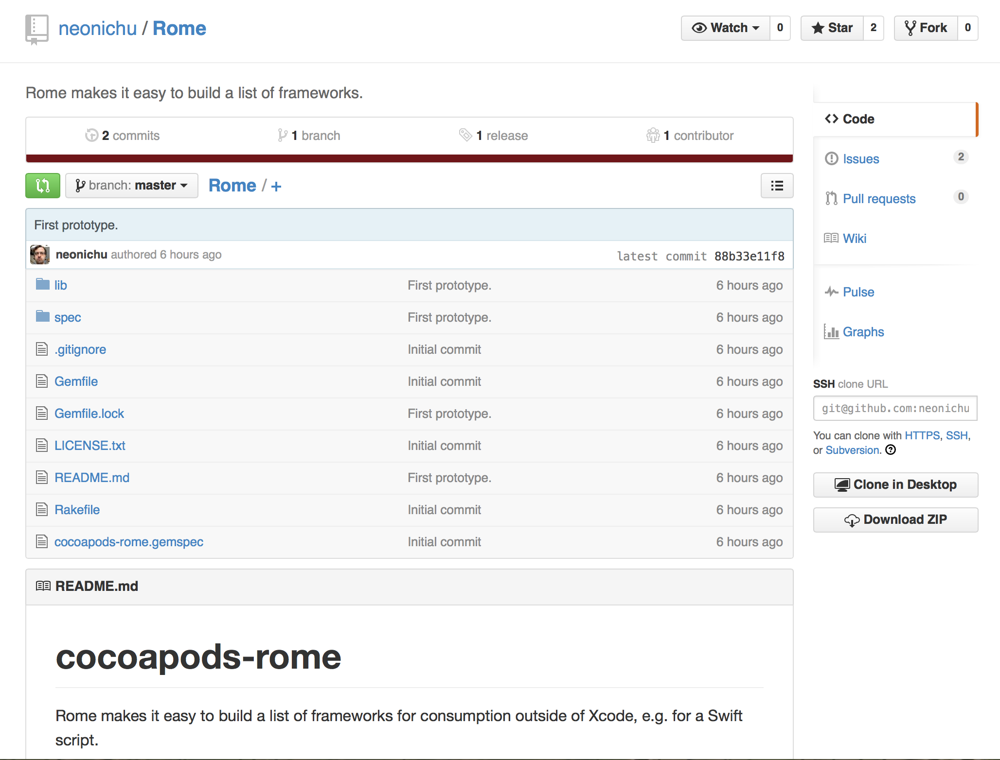
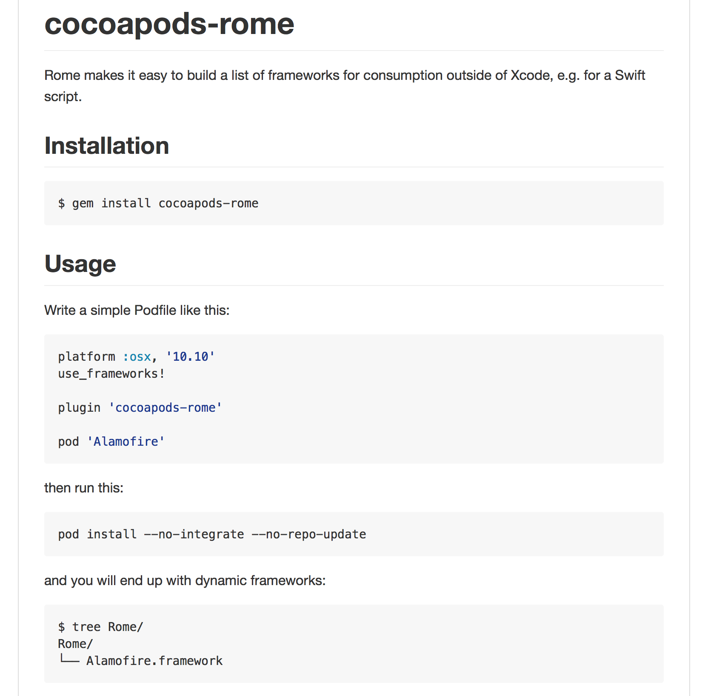

# Swift **Scripting**
### Ayaka Nonaka
#### @ayanonagon

---

# **Designers**
# Engineers

---

# :moyai:

* Designer designs and exports assets

---

# :moyai:

* Designer designs and exports assets
* Upload to Dropbox or send over Slack

---

# :moyai:

* Designer designs and exports assets
* Upload to Dropbox or send over Slack
* Engineer adds to venmo-ios codebase

---

# :sob:

---

# :sob:

* So many Dropbox links & Slack messages, gets confusing

---

# :sob:

* So many Dropbox links & Slack messages, gets confusing
* Sometimes assets sizes are wrong

---

# :sob:

* So many Dropbox links & Slack messages, gets confusing
* Sometimes assets sizes are wrong
* No easy way to see all the assets in our app

---

# :bulb:

---


## *pod 'venmo-ios-images'*

---

# :bulb:

* Designer designs and exports assets

---

# :bulb:

* Designer designs and exports assets
* Designer makes pull-request to venmo-ios-images repo

---

# :bulb:

* Designer designs and exports assets
* Designer makes pull-request to venmo-ios-images repo
* Engineer reviews changes and merges

---
# :bulb:

* Designer designs and exports assets
* Designer makes pull-request to venmo-ios-images repo
* Engineer reviews changes and merges
* Engineer generates UIImage category for the new image(s)

---
# :bulb:

* Designer designs and exports assets
* Designer makes pull-request to venmo-ios-images repo
* Engineer reviews changes and merges
* Engineer generates UIImage category for the new image(s)
* pod update :rocket:

---

* Engineer generates UIImage category for the new image(s)

---

# We’re **LAZY**

---

# Automate all the things!

---

# **Script** all the things!

---

## Scripting

* Run from CLI

---

## Scripting

* Run from CLI
* Light-weight (no Xcode projects?)

---


---

## Scripting

* Run from CLI
* Light-weight (no Xcode projects?)

---

## Scripting

* Run from CLI
* Light-weight (no Xcode projects?)
* Tooling

---

# January 22nd, 2015

Ayaka Nonaka [11:07 AM]
ok time to write..... ruby? or.... swift?!

---

# January 22nd, 2015

Ayaka Nonaka [11:07 AM]
ok time to write..... ruby? or.... swift?!
actually not sure if i want to go down that path

---

# January 22nd, 2015

Ayaka Nonaka [11:07 AM]
ok time to write..... ruby? or.... swift?!
actually not sure if i want to go down that path
a 2 day long project is going to turn into like a 7 day long project lol

---

# January 22nd, 2015

Ayaka Nonaka [11:07 AM]
ok time to write..... ruby? or.... swift?!
actually not sure if i want to go down that path
a 2 day long project is going to turn into like a 7 day long project lol
i might look into swift though

---

# January 22nd, 2015

Ayaka Nonaka [11:07 AM]
ok time to write..... ruby? or.... swift?!
actually not sure if i want to go down that path
a 2 day long project is going to turn into like a 7 day long project lol
i might look into swift though
that might be kind of fun

---

# January 22nd, 2015

Eli Perkins [11:08 AM]
swift could be fun!

---

# :smirk:
# Challenge accepted

---


```swift
#!/usr/bin/env xcrun swift

import Foundation

// MARK: - Helpers

func writeNewline(outputStream: NSOutputStream) {
    outputStream.write("\n", maxLength: 1)
}

func writeLine(outputStream: NSOutputStream, string: String) {
    outputStream.write(string, maxLength: countElements(string))
    writeNewline(outputStream)
}

func methodDeclarationFromFileName(fileName: String) -> String {
    let noUnderscoresFileName = fileName.stringByReplacingOccurrencesOfString("_", withString: "", options: .LiteralSearch, range: nil)
    let uncapitalizedFileName = uncapitalized(noUnderscoresFileName)
    return "+ (UIImage *)ven_\(uncapitalizedFileName)"
}

func uncapitalized(string: String) -> String {
    var index = advance(string.startIndex, 1)
    let first = string.substringToIndex(index)
    let rest = string.substringFromIndex(index)
    return "\(first.lowercaseString)\(rest)"
}

func fileNameWithoutExtension(fileName: String) -> String {
    let pattern = "(([a-zA-Z]|_)*)(@2x|@3x)?\\.png"
    let expression = NSRegularExpression(pattern: pattern, options: nil, error: nil)
    let result = expression!.matchesInString(fileName, options: nil, range: NSRange(location: 0, length: countElements(fileName)))
    let textCheckingResult = result[0] as NSTextCheckingResult
    let range = textCheckingResult.rangeAtIndex(1)
    return (fileName as NSString).substringWithRange(range)
}

func imageFileNames(path: String) -> [String] {
    let fileManager = NSFileManager.defaultManager()
    let enumerator = fileManager.enumeratorAtPath(path)

var fileNames = NSMutableOrderedSet()
    while let fileName = enumerator?.nextObject() as? String {
        if fileName.hasSuffix("png") {
            fileNames.addObject(fileNameWithoutExtension(fileName))
        }
    }
    return fileNames.array as [String]
}


// MARK: - Script that generates UIImage+VenmoImages category class

let fileNames = imageFileNames("generated-assets")

let categoryName = "UIImage+VenmoImages"
let headerFileName = "\(categoryName).h"

// Generate the interface
if let outputStream = NSOutputStream(toFileAtPath: headerFileName, append: false) {
    outputStream.open()
    writeLine(outputStream, "#import <Foundation/Foundation.h>")
    writeNewline(outputStream)
    writeLine(outputStream, "@interface UIImage (VenmoImages)")
    writeNewline(outputStream)

    for fileName in fileNames {
        writeLine(outputStream, "\(methodDeclarationFromFileName(fileName));")
    }

    writeNewline(outputStream)
    writeLine(outputStream, "@end")
    outputStream.close()
} else {
    println("Unable to open interface file")
}

// Generate the implementation
if let implOutputStream = NSOutputStream(toFileAtPath: "\(categoryName).m", append: false) {
    implOutputStream.open()
    writeLine(implOutputStream, "#import \"\(headerFileName)\"")
    writeNewline(implOutputStream)
    writeLine(implOutputStream, "@implementation UIImage (VenmoImages)")
    writeNewline(implOutputStream)

    for fileName in fileNames {
        writeLine(implOutputStream, "\(methodDeclarationFromFileName(fileName))")
        writeLine(implOutputStream, "{")
        writeLine(implOutputStream, "    return [UIImage imageNamed:@\"Venmo.bundle/\(fileName)\"];")
        writeLine(implOutputStream, "}")
        writeNewline(implOutputStream)
    }

    writeLine(implOutputStream, "@end")
    implOutputStream.close()
} else {
    println("Unable to open implementation file")
}
```

---

# Swift 
* familiar API’s

---

# Swift 
* familiar API’s
* “light” feeling language

---

# Swift 
* familiar API’s
* “light” feeling language
* overly protective compiler is a caring compiler

---

## Reduce language dependencies

---

## Non “production” use

---

## Just another reason to write **Swift**

---

### xcrun swift hello-world.swift

---

### chmod +x hello-world.swift

---

### #!/usr/bin/env xcrun swift

---

### ./hello-world.swift

---

Live Demo!

---

## dependency management?

---

# git submodules

* Simple, does very little.
* Maybe too little?

---

# CocoaPods

* Swift!
* Does dependency management.
* Relies on Xcode project.

---

# Carthage

* Swift!
* Does dependency management.
* Manually add framework to project.

---

# Cartfile

```
github "jdhealy/PrettyColors"
github "Alamofire/Alamofire"
```

---

# $ carthage bootstrap

```
*** No Cartfile.resolved found, updating dependencies
*** Fetching PrettyColors
*** Fetching Alamofire
*** Checking out Alamofire at "1.1.4"
*** Checking out PrettyColors at "v1.0.0"
*** xcodebuild output can be found in /var/folders/blah
*** Building scheme "Alamofire iOS" in Alamofire.xcworkspace
*** Building scheme "Alamofire OSX" in Alamofire.xcworkspace
*** Building scheme "PrettyColors iOS" in PrettyColors.xcodeproj
*** Building scheme "PrettyColors Mac" in PrettyColors.xcodeproj
```

---

```
➜  swiftsummit git:(master) ✗ ls Carthage/Build/iOS
Alamofire.framework    PrettyColors.framework
```

---

## /Library/Frameworks
## ?

---

```
➜  swiftsummit git:(master) ✗ swift -help
OVERVIEW: Swift compiler

USAGE: swift [options] <inputs>

OPTIONS:
  ...
  -F <value>             Add directory to framework search path
```

---

```
#!/usr/bin/env xcrun swift -F Carthage/Build/iOS
```

---

# The missing stuff

* Auto-completion

---

# The missing stuff

* Auto-completion
* A better way to do dependency management

---

# The missing stuff

* Auto-completion
* A better way to do dependency management
* More tools

---

* Keithbsmiley/swift.vim
* jdhealy/PrettyColors
* thoughtbot/Argo
* kylef/CLIKit
* nomothetis/SemverKit
* BananaKit? :banana:
* ???

---


# *Plot Twist*

---


---



---



---

## bit.ly/swiftscripting

---

# ???
#### @ayanonagon

---
