build-lists: true

---
# Test Slide

* Can you read me?
* Here’s some code

```swift
func foo(bar: String) {
    print("Hello world")
}
```

---

## **Hi, I’m Ayaka**
### @ayanonagon


---

# Workflow


---


---

## **Mutability is bad!**

---

## **Shared state causes bugs!**

---

## **Functional programming!**

---

## **Make things immutable!**

---

## **Use value types!**

---

## **Use structs over classes!**

---

## **Monads!**

---

## **Eat burritos!**

---


---

# [fit] Immutable
# [fit] all the things!

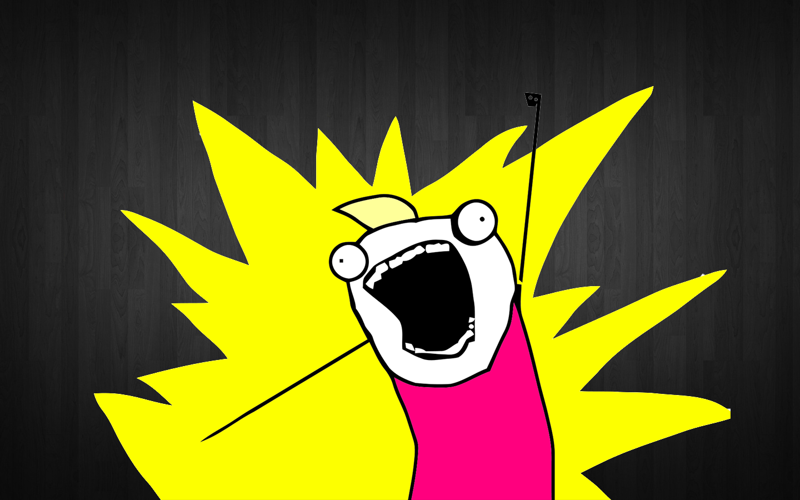

---

# [fit] :smile:

---


# [fit] :grinning:

---

# [fit] :neutral_face:

---

# [fit] :confused:

---

# [fit] :fearful:

---

# [fit] :sob:

---

# … Classes?

---

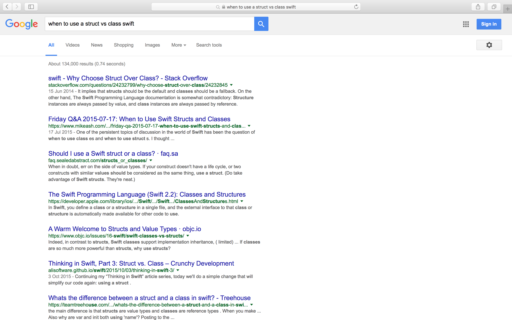

---

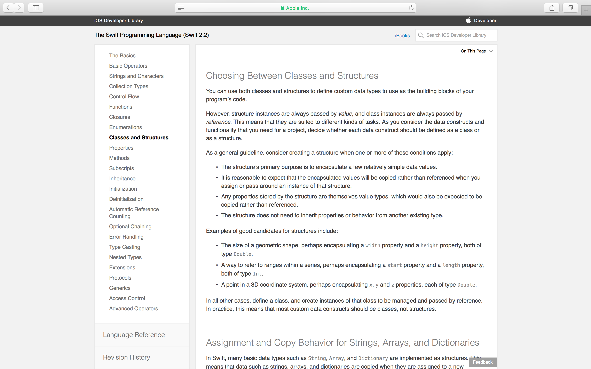

---

* The structure’s primary purpose is to encapsulate a few relatively simple data values.
* It is reasonable to expect that the encapsulated values will be copied rather than referenced when you assign or pass around an instance of that structure.
* Any properties stored by the structure are themselves value types, which would also be expected to be copied rather than referenced.
* The structure does not need to inherit properties or behavior from another existing type.

---

# [fit] :no_mouth:

---


---

## Functional Core
## **- & -**
## Imperative Shell

---

# Functional Core
* Immutable
* Value types
* Safe?

---

# Imperative Shell
* Mutable
* Passed by reference
* Dangerous?

---

# App = Many Functional Cores


---

# with Imperative Shells

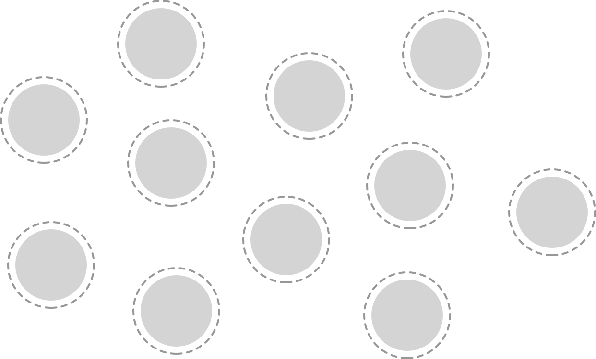

---

### **“All you really know maybe is that your taste is improving a lot faster than your ability.”**

#### Andy Matuschak, Advanced iOS Application Architecture and Patterns (WWDC 2014)


---

# [fit] Boundaries **in Practice**
### **iOSCon** 2016
#### @ayanonagon


---

### Inherently Stateful
# [fit] Networking

---

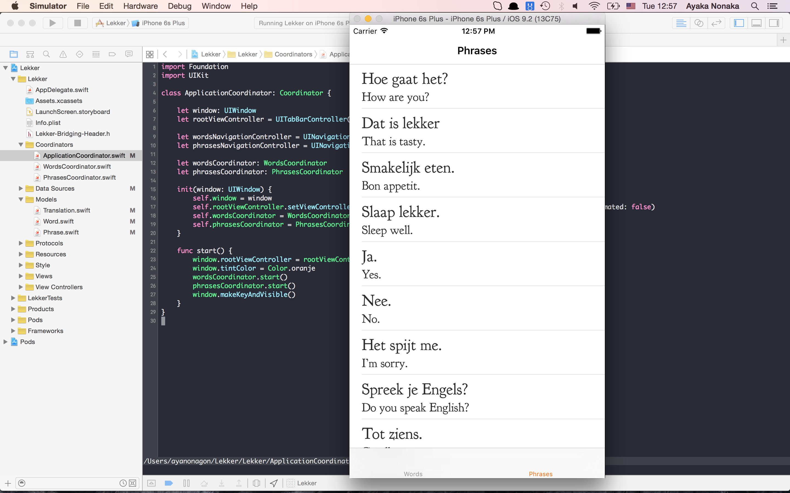

---

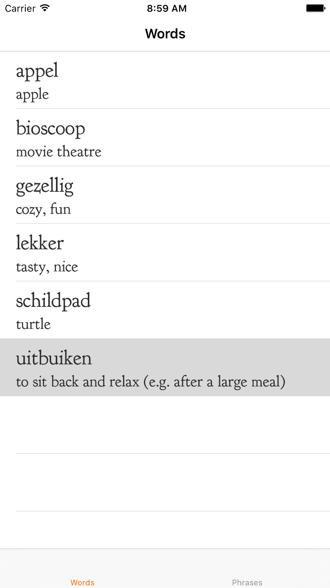

---

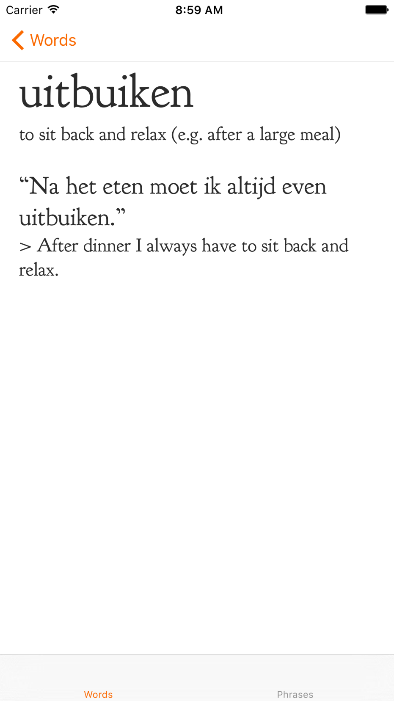

---


```swift

struct Word {
    let ID: String
    let native: String
    let translations: [Translation]
    let examples: [Phrase]
}
```

---

```swift
class WordDetailViewController: UIViewController {
    init(word: Word)
}
```

---

```swift
class WordDetailViewController: UIViewController {
    private let titleView: TitleView
    private let translationsView: TranslationsView
    private let examplesView: ExamplesView

    init(word: Word) {
        titleView = TitleView(word: word.native)
        tranlationsView = TranslationsView(translations: word.translations)
        examplesView = ExamplesView(examples: word.examples)
    }

    // ...
}
```

---

```swift
class WordsViewController: UIViewController {
    let words: [Word]
    // ...
}
```

---

```
lekker://words/12345
```

---

```swift
class WordDetailViewController: UIViewController {
    private let titleView: WordTitleView
    private let translationsView: TranslationsView
    private let examplesView: ExamplesView

    init(word: Word) { /* Same as before */ }
    init(wordID: String) {
        // Hmmmmmm.
    }

    // ...
}
```

---

```swift
class WordDetailViewController: UIViewController {
    private var titleView: WordTitleView?
    private var translationsView: TranslationsView?
    private var examplesView: ExamplesView?

    init(word: Word) { /* Same as before */ }
    init(wordID: String) {
        self.titleView = nil
        self.translationsView = nil
        self.examplesView = nil
    }
    
    // Load everything in viewDidLoad?
}
```

---

```swift
class WordContainerViewController: UIViewController {
    let wordID: String

    init(wordID: String) {
        self.wordID = wordID
    }

    override func viewDidLoad() {
        client.showWord(ID: wordsID) { result in
            switch result {
            case .Success(let word):
                let viewController = WordDetailViewController(word: word)
                self.addChildViewController(viewController)
                self.view.addSubview(viewController.view)
                viewController.view.frame = view.bounds
                viewController.didMoveToParentViewController(self)
            case .Error(let error): // Show error
            }
        }
    }
}
```

---

```
lekker://words/12345
```

```swift
WordContainerViewController(wordID: "12345")
```

---

```
lekker://words/12345
```

---

```
lekker://words/12345
lekker://phrases/007
```

---

```
lekker://words/12345
lekker://phrases/007
lekker://tips/9876
```

---

```swift
protocol RemoteContentProviding {
    typealias Content

    func fetchContent(completion: Result<Content, Error> -> Void)
    func viewControllerForContent(content: Result<Content, Error>) -> UIViewController
}
```

---

```swift
class RemoteContentContainerViewController<T: RemoteContentProviding>: UIViewController {
    let provider: T

    init(provider: T) {
        self.provider = provider
        super.init(nibName: nil, bundle: nil)
    }

    override func viewDidLoad() {
        super.viewDidLoad()

        provider.fetchContent { content in
            let viewController = self.provider.viewControllerForContent(content)
            self.addChildViewController(viewController)
            self.view.addSubview(viewController.view)
            viewController.view.frame = view.bounds
            viewController.didMoveToParentViewController(self)
        }
    }
}
```

---

```swift
struct WordProvider: RemoteContentProviding {
    let ID: String

    func fetchContent(completion: Result<Word, Error> -> Void) {
        client.showWord(ID: ID, completion: completion)
    }

    func viewControllerForContent(content: Result<Word, Error>) -> UIViewController {
        switch content {
        case .Success(let word): return WordDetailViewController(word: word)
        case .Error(_): return ErrorViewController(title: "Could not find word.")
        }
    }
}
```

---

```
lekker://words/12345
```

```swift
let provider = WordProvider(ID: "12345")
RemoteContentContainerViewController(provider: provider)
```

---

```
lekker://phrases/007
```

```swift
let provider = PhraseProvider(ID: "007")
RemoteContentContainerViewController(provider: provider)
```

---

```
lekker://tips/9876
```

```swift
let provider = TipProvider(ID: "9876")
RemoteContentContainerViewController(provider: provider)
```

---

```swift
class WordDetailViewController: UIViewController {
    private var titleView: WordTitleView?
    private var translationsView: TranslationsView?
    private var examplesView: ExamplesView?

    init(word: Word) { /* Same as before */ }
    init(wordID: String) {
        self.titleView = nil
        self.translationsView = nil
        self.examplesView = nil
    }

    // Load everything in viewDidLoad?
}
```

---

```swift
class WordDetailViewController: UIViewController {
    private let titleView: TitleView
    private let translationsView: TranslationsView
    private let examplesView: ExamplesView

    init(word: Word) {
        titleView = TitleView(title: word.native)
        tranlationsView = TranslationsView(translations: word.translations)
        examplesView = ExamplesView(examples: word.examples)
    }

    // ...
}
```

---

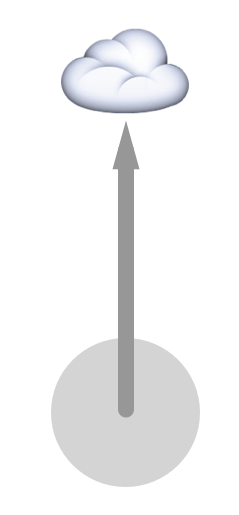

---

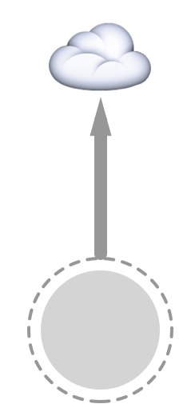

---

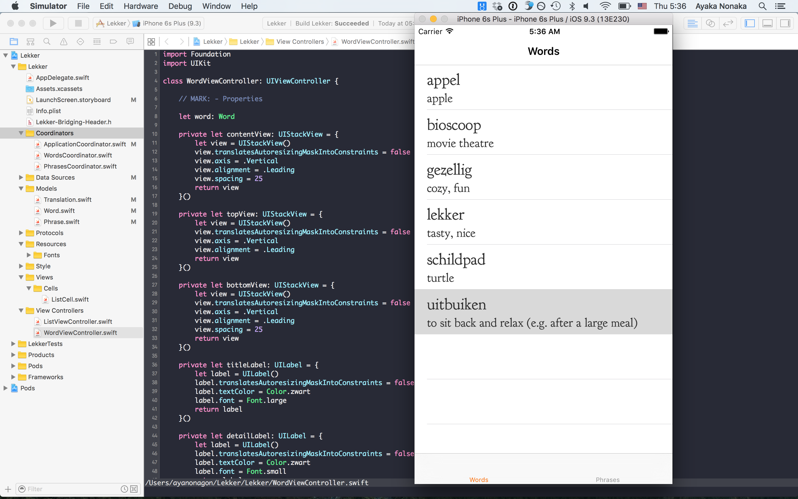

---

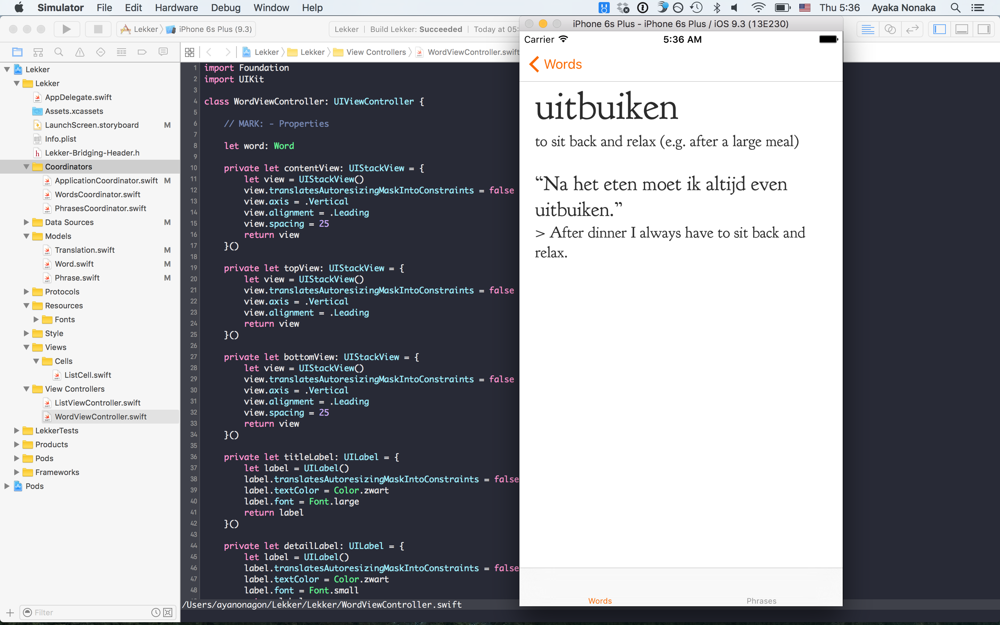

---

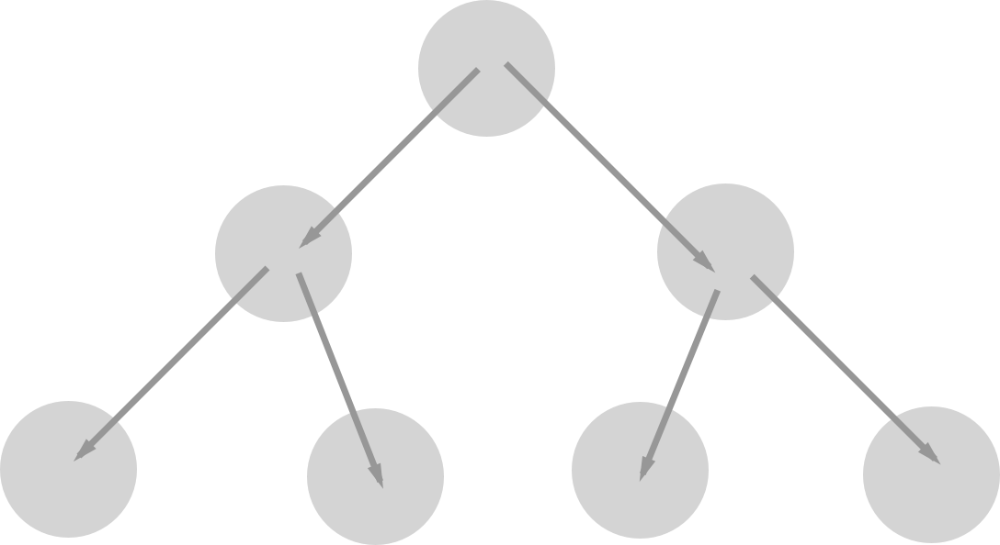

---

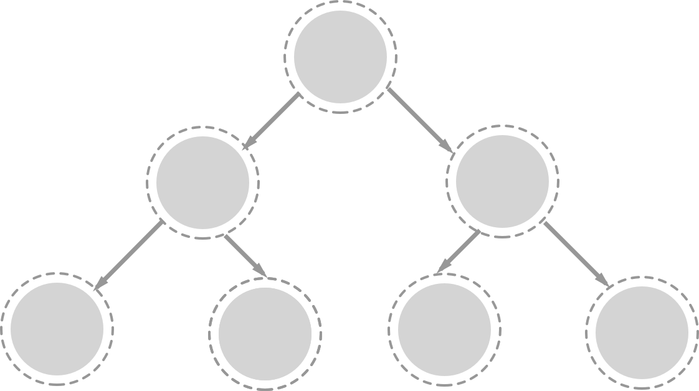

---

# [fit] Coordinators
#### Soroush Khanlou @ NSSpain 2015

^ One of those ideas is the Coordinators design pattern. I first heard about it last year at a talk given by Soroush at NSSpain.

---

### View Controllers don’t know about other View Controllers

^ The main idea behind coordinators is that view controllers don’t know about other view controllers.

^ Let’s look at some code.

---

```swift
@UIApplicationMain
class AppDelegate: UIResponder, UIApplicationDelegate {

    var window: UIWindow?

    private lazy var applicationCoordinator: ApplicationCoordinator = {
        return ApplicationCoordinator(window: self.window!)
    }()

    func application(application: UIApplication, didFinishLaunchingWithOptions
                     launchOptions: [NSObject: AnyObject]?) -> Bool {
        window = UIWindow(frame: UIScreen.mainScreen().bounds)
        applicationCoordinator.start() 
        return true
    }
}
```

^ Let’s start with the App Delegate. By the way, can we please admire how tiny this is?

^ The App Delegate has a window as usual and ...

^ Before we take a look at the ApplicationCoordinator, let’s look at the Coordinator protocol.

---

```swift
protocol Coordinator {
    func start()
}
```

^ There are different ways to define a coordinator protocol, but the one I defined is very minimal.

^ All it requires is a start function to kick things off. So let’s look at what an implementation of a coordinator would look like.

---

```swift
class ApplicationCoordinator: Coordinator {

    let window: UIWindow
    let rootViewController = UITabBarController()

    let wordsNavigationController = UINavigationController()
    let phrasesNavigationController = UINavigationController()

    let wordsCoordinator: WordsCoordinator
    let phrasesCoordinator: PhrasesCoordinator

    init(window: UIWindow) {
        self.window = window
        let viewControllers = [wordsNavigationController, phrasesNavigationController]
        self.rootViewController.setViewControllers(viewControllers, animated: false)
        self.wordsCoordinator = WordsCoordinator(presenter: wordsNavigationController)
        self.phrasesCoordinator = PhrasesCoordinator(presenter: phrasesNavigationController)
    }

    func start() {
        window.rootViewController = rootViewController
        wordsCoordinator.start()
        phrasesCoordinator.start()
        window.makeKeyAndVisible()
    }
}
```

---

```swift
class WordsCoordinator: Coordinator {

    let presenter: UINavigationController

    private let listViewController: ListViewController<Word>
    private let dataSource: WordsDataSource

    init(presenter: UINavigationController) {
        self.presenter = presenter
        self.dataSource = WordsDataSource()
        self.listViewController = ListViewController<Word>()
        self.listViewController.title = "Words"
        self.listViewController.items = dataSource.words
        self.listViewController.configureCell = { cell, item in
            cell.item = item
        }
        self.listViewController.didSelectItem = { item in
            presenter.pushViewController(WordDetailViewController(word: item), animated: true)
        }
    }

    func start() {
        presenter.pushViewController(listViewController, animated: false)
    }
}
```

---

```swift
class PhrasesCoordinator: Coordinator {

    let presenter: UINavigationController

    private let listViewController: ListViewController<Phrase>
    private let dataSource: PhrasesDataSource

    init(presenter: UINavigationController) {
        self.presenter = presenter
        self.dataSource = PhrasesDataSource()
        self.listViewController = ListViewController<Phrase>()
        self.listViewController.title = "Phrases"
        self.listViewController.items = dataSource.phrases
        self.listViewController.configureCell = { cell, item in
            cell.item = item
        }
        self.listViewController.didSelectItem = { item in
            presenter.pushViewController(PhraseViewController(phrase: item), animated: true)
        }
    }

    func start() {
        presenter.pushViewController(listViewController, animated: false)
    }
}
```

---

```
                ApplicationCoordinator
                /          \
    WordsCoordinator   PhrasesCoordinator
```

^ When you use coordinators, the backbone of your application becomes a tree of coordinators.

---

```
                ApplicationCoordinator
                /          \
        WordsCoordinator   PhrasesCoordinator
        /
    SearchCoordinator
```

^ If we wanted to add a feature that adds search functionality for words, we can create a new search coordinator and have the words coordinator manage that.

---

```

                    ApplicationCoordinator
                    /           \
        DictionaryCoordinator   LoginCoordinator
        /               \
    WordsCoordinator   PhrasesCoordinator
    /
SearchCoordinator
```

^ If we wanted to add login functionality, that’s also easy. We can add a layer with a dictionary coordinator to manage the tabs, and a login coordinator to manage the login flow.

---


```
                            ApplicationCoordinator
                        /           \                 \
        DictionaryCoordinator  LoginCoordinator   SignUpCoordinator
            /          \
    WordsCoordinator   PhrasesCoordinator
    /
SearchCoordinator
```

^ And if we want to add a sign up flow, we can add a sign up coordinator that’s managed by the application coordinator. It’s pretty awesome to work with.

---


---


---

# [fit] Abstraction


---

```swift
class WordDetailViewController: UIViewController {
    init(word: Word)
    init(wordID: String)
}
```

---

```swift
class WordDetailViewController: UIViewController {
    private var titleView: WordTitleView?
    private var translationsView: TranslationsView?
    private var examplesView: ExamplesView?

    init(word: Word) { /* Same as before */ }
    init(wordID: Word) {
        self.titleView = nil
        self.translationsView = nil
        self.examplesView = nil
    }

    // Load everything in viewDidLoad?
}
```

---

# Imperative **Shell**

---

# Imperative Shell

```swift
protocol RemoteContentProviding {
    typealias Content

    func fetchContent(completion: Result<Content, Error> -> Void)
    func viewControllerForContent(content: Result<Content, Error>) -> UIViewController
}
```

---

# Functional Core

```swift
class WordDetailViewController: UIViewController {
    private let titleView: TitleView
    private let translationsView: TranslationsView
    private let examplesView: ExamplesView

    init(word: Word) {
        titleView = TitleView(title: word.native)
        tranlationsView = TranslationsView(translations: word.translations)
        examplesView = ExamplesView(examples: word.examples)
    }

    // ...
}
```

---

# Functional Core
* Immutable
* Value types
* Safe?

---

# Functional Core
* Immutable
* Value types
* Solid

---

# Imperative Shell
* Mutable
* Passed by reference
* Dangerous?

---

# Imperative Shell
* Mutable
* Passed by reference
* **Fluid**

---

# Solid
### Functional Core


---

# **Fluid**
### Imperative Shell


---

# **Fluid** // Solid


---

# :eyes:

* Gary Bernhardt: Boundaries
* Soroush Khanlou: Presenting Coordinators
* Rob Rix: Many Types Make Light Work
* objc.io: Functional Snippet #22: Typed Table View Controllers Redux

---

## :coffee: :fire: :beers:


---

# **Thank you!**
### @ayanonagon


---
