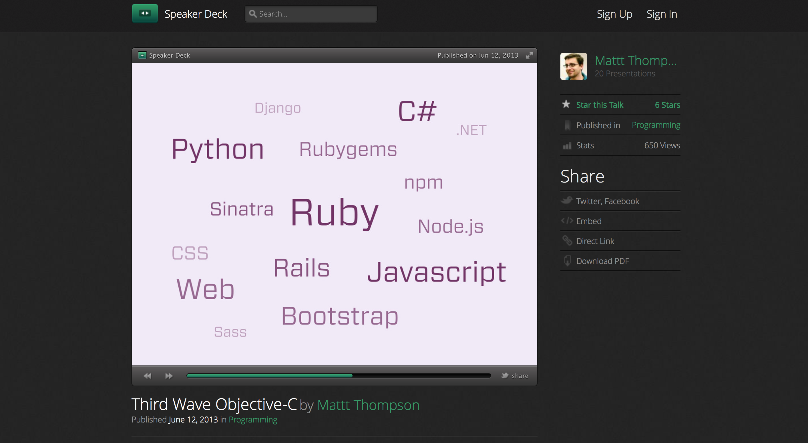
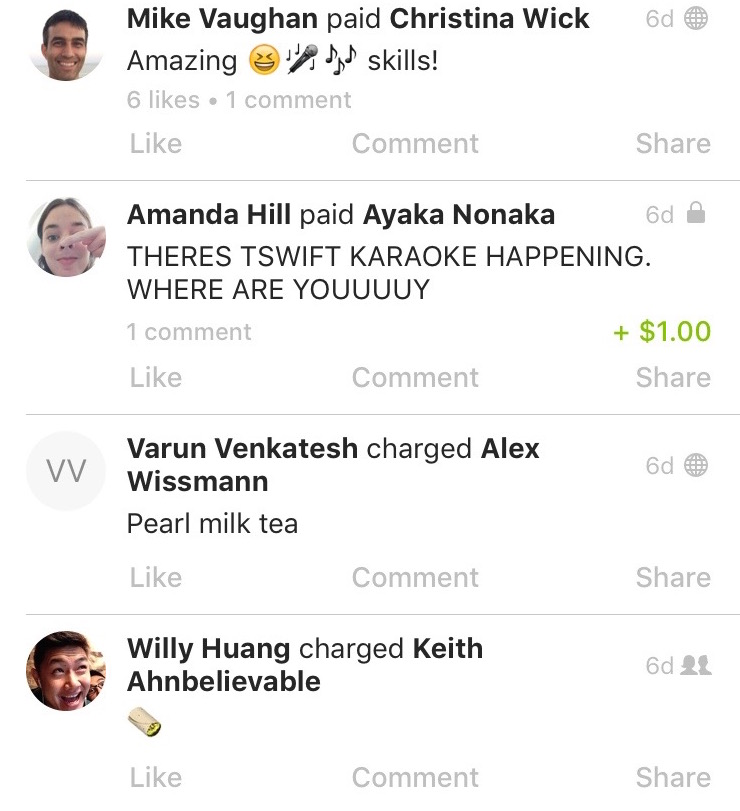
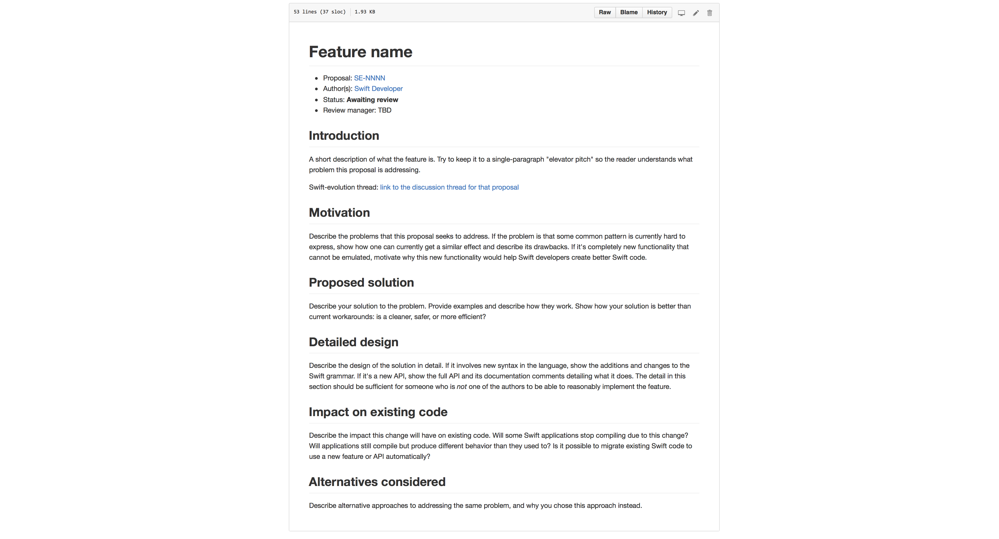
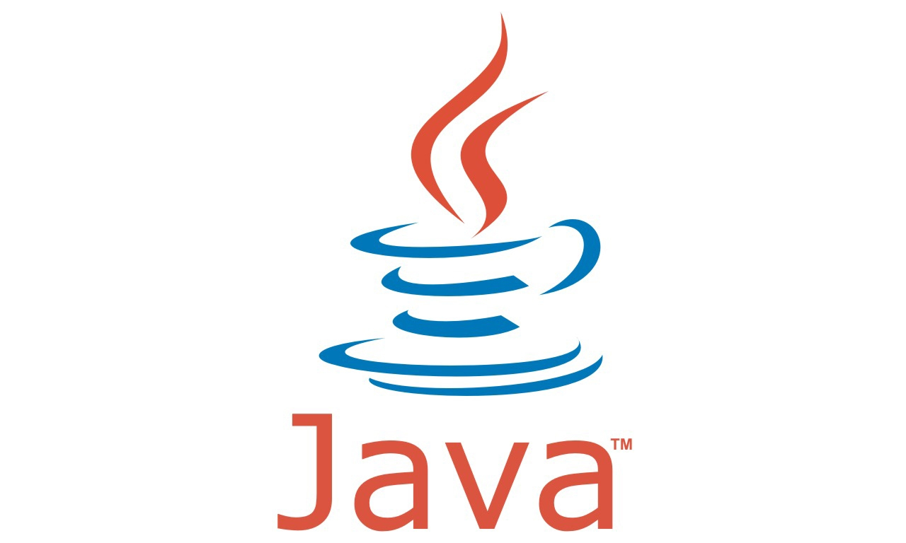

# [fit] Going _Swift_
# [fit] _And_ Beyond
### @ayanonagon
#### dotSwift 2016

---

# 2013


^ In 2013, I was in San Francisco for the first time during WWDC week. I didn’t have a ticket, but I went to a bunch of WWDC-related events. One of the events that I attended was the CocoaPods meet up, where Mattt Thompson gave a talk titled

---


^ Third wave Objective-C. In his talk, Mattt went over the history of Objective-C, starting in 1983, that’s 33 years ago!
^ He explained that  ... // TODO

---

1. NeXTSTEP
2. OS X
3. iOS

---

# Borrowed Ideas


^ He highlighted that a lot of the ideas and methedologies introduced in the third-wave of Objective-C are from borrowed ideas.

---



^ Borrowed ideas from all different languages. Dependecy managers like CocoaPods are inspired by Bundler and Gems, which are both from the Ruby community. Even testing frameworks, like Specta and Expecta are based on a Ruby testing framework. // TODO

---


# First Wave Swift

^ A little over a year ago, Swift was announced. We’re a part of the “First Wave” of Swift. And I think that’s really exciting.

^ It’s natural in the first wave of something for us to write code like we used to, just using the syntax of our new language - but as we embrace Swift we find that it changes our code, our architecture, our apps, and how we spend our time.

---

# What
# How
# Why

^ Today, I’d like to focus on three things.

^ First, we’ll go over the what. Swift is a new programming language. How does it change WHAT kind of code we write and the way we architect our code?

^ After that, we’re going to focus on the “beyond” part. How does Swift change how we write code? And lastly, how does it affect why we do things the way we do them?

---

# [fit] What


^ At Venmo, we’ve been rewriting our entire existing Objective-C app in Swift. Even though we’re rebuilding the same product and features for the most part, but we noticed that a lot of our architectural decisions were different because of new language features.

---



---


---

```swift
struct Story {
    let ID: String
    let title: String
    let message: String
    let sender: User
    let recipient: User
    let date: NSDate
    // ...
}
```

---

```swift
class StoriesViewController: UIViewController {
    let stories: [Story]
    // ...
}

```

---

```swift
class StoryDetailViewController: UIViewController {
    init(story: Story)
}
```

---

```swift
class StoryDetailViewController: UIViewController {
    private let titleView: StoryTitleView
    private let senderView: AvatarView
    private let recipientView: AvatarView
    private let dateLabel: DateLabel

    init(story: Story) {
        titleView = StoryTitleView(story: story)
        senderView = AvatarView(user: story.sender)
        recipientView = AvatarView(user: story.recipient)
        dateLabel = DateLabel(date: story.date)
    }

    // ...
}
```

---

`url_scheme://stories/12345`

---

```swift
class StoryDetailViewController: UIViewController {
    init(story: Story)
}

```

---

```swift
class StoryDetailViewController: UIViewController {
    init(story: Story)
    init(storyID: String)
}

```

---

```swift
class StoryDetailViewController: UIViewController {
    private let titleView: StoryTitleView
    private let senderView: AvatarView
    private let recipientView: AvatarView
    private let dateLabel: DateLabel

    init(story: Story) { /* Same as before */ }
    init(storyID: String) {
        // Hmmmmmmm.
    }
}

```

---

```swift
class StoryDetailViewController: UIViewController {
    let storyID: String

    private var titleView: StoryTitleView?
    private var senderView: AvatarView?
    private var recipientView: AvatarView?
    private var dateLabel: DateLabel?

    init(story: Story) { /* Same as before */ }
    init(storyID: String) {
        self.storyID = storyID
        titleView = nil
        senderView = nil
        recipientView = nil
        dataLabel = nil
    }

    // Load everything from API in viewDidLoad?
}

```

^ There are question marks everywhere. I think this is very questionable code.

---

```swift
class StoryContainerViewController: UIViewController {
    let storyID: String

    init(storyID: String) {
        self.storyID = storyID
    }

    override func viewDidLoad() {
        client.showStory(ID: storyID) { result in
            switch result {
            case .Success(let story):
                let viewController = StoryDetailViewController(story: story)
                self.addChildViewController(viewController)
                self.view.addSubview(viewController.view)
                viewController.view.frame = view.bounds
                viewController.didMoveToParentViewController(self)
            case .Error(let error): // Show error
            }
        }
    }
}
```

---

```
url_scheme://stories/12345
```

```swift
StoryContainerViewController(storyID: "12345")
```

---

```
url_scheme://stories/12345
```

---

```
url_scheme://stories/12345
url_scheme://users/007
```

---

```
url_scheme://stories/12345
url_scheme://users/007
url_scheme://messages/9876
```

---

```swift
protocol RemoteContentCoordinator {
    typealias Content

    func fetchContent(completion: Result<Content, Error> -> Void)
    func viewControllerForContent(content: Result<Content, Error>) -> UIViewController
}
```

---

```swift
class RemoteContentContainerViewController<T: RemoteContentCoordinator>: UIViewController {
    let coordinator: T

    init(coordinator: T) {
        self.remoteContentCoordinator = remoteContentCoordinator
        super.init(nibName: nil, bundle: nil)
    }

    override func viewDidLoad() {
        super.viewDidLoad()

        coordinator.fetchContent { content in
            let viewController = self.coordinator.viewControllerForContent(content)
            self.addChildViewController(viewController)
            self.view.addSubview(viewController.view)
            viewController.view.frame = view.bounds
            viewController.didMoveToParentViewController(self)
        }
    }
}
```

---

```swift
struct StoryCoordinator: RemoteContentCoordinator {
    let ID: String

    func fetchContent(completion: Result<Story, Error> -> Void) {
        client.showStory(ID: ID, completion: completion)
    }

    func viewControllerForContent(content: Result<Story, Error>) -> UIViewController {
        switch content {
        case .Success(let story): return StoryDetailViewController(story: story)
        case .Error(_): return ErrorViewController(title: "Could not find story.")
        }
    }
}

```

---

```
url_scheme://stories/12345
```

```swift
let coordinator = StoryCoordinator(ID: "12345")
RemoteContentContainerViewController(coordinator: coordinator)
```

---

```
url_scheme://users/007
```

```swift
let coordinator = UserCoordinator(ID: "007")
RemoteContentContainerViewController(coordinator: coordinator)
```

---

```
url_scheme://messages/9876
```

```swift
let coordinator = MessageCoordinator(ID: "9876")
RemoteContentContainerViewController(coordinator: coordinator)
```

---

```swift
class StoryDetailViewController: UIViewController {
    let storyID: String

    private var titleView: StoryTitleView?
    private var senderView: AvatarView?
    private var recipientView: AvatarView?
    private var dateLabel: DateLabel?

    init(story: Story) { /* Same as before */ }
    init(storyID: String) {
        self.storyID = storyID
        titleView = nil
        senderView = nil
        recipientView = nil
        dataLabel = nil
    }

    // Load everything from API in viewDidLoad?
}
```

---

```swift
class StoryDetailViewController: UIViewController {
    private let titleView: StoryTitleView
    private let senderView: AvatarView
    private let recipientView: AvatarView
    private let dateLabel: DateLabel

    init(story: Story) {
        titleView = StoryTitleView(story: story)
        senderView = AvatarView(user: story.sender)
        recipientView = AvatarView(user: story.recipient)
        dateLabel = DateLabel(date: story.date)
    }

    // ...
}
```

^ Doing this, we were able to write code that was very Swift-oriented, or Swifty, as some might say. But what if we looked a little beyond the code?

---

# [fit] How


^ I think Swift also influences _how_ we write our code. There are a couple of ways that Swift has influenced how our team writes code.

---

## Swift is __open-source__

^ As most of you probably know, Swift is open-source.

---

## github.com/apple/_swift_

^ All of the code is here, and it’s really cool. But there’s another thing that’s really awesome, and that swift-evolution.

---

## github.com/apple/_swift-evolution_

^ Swift evolution is where developers can make proposals to make changes and improvements to the Swift language and ecosystem. The proposal system has a structure. They provide us with a template

---



^ that helps us communicate what the change is and the reasoning behind it.

---


^ We thought this was cool, and one of our developers Mark created a repo called Blueprint, that we now use for making architectural proposals to the Venmo codebase. So now, every time we make a change that affects a large part of the codebase, or are working on a new feature, we start by opening a pull-request to Blueprint before starting to write any real code.

---

## *80%* planning
## _20%_ coding

---

# [fit] Why

^ Always be critical of the tools and languages you use.
^ Learn from others.
^ We want to pick the tools that deliver the best experience to our users.


^ I’m standing here on stage today giving a talk about Swift, but believe it or not, before Swift came out I looooved Objective-C. Please don’t tell anyone. A lot of people who wrote “cooler” programming languages like Ruby, Python, and even Javascript and Java developers always made fun of Objective-C, and I always defended it. It was my first programming language that I used in industry, and it let me make fun apps for the iPhone. I was perfectly content with Objective-C, ignoring all of the other languages out there.

^ At WWDC 2014, Swift was announced. I remember the long silence in the audience, followed by a roaring cheer of excitement for the future of development. The excitement continued after that week and beyond the Cocoa community. When I got back to my day to day at the San Francisco office, everyone was talking about it. In fact, there was interest from various developers to watch one of the advanced Swift WWDC talks during lunch. So we all got together in one of the big meeting rooms, and watched the talk!

^ When I looked around in the room, there were developers who worked with all sorts of different platforms. Android, front-end, backend. Java, Javascript, Ruby, Python. All of these developers were genuinely interested in learning about Swift.

---

# Generics
# Enums
# Protocols

^ Some of the concepts that were presented are generics, enums, and protocols. They’re new and shiny to a lot of us, but guess what language has had all of these, including first-class enums. Java!

---

# Generics
# Enums
# Protocols



---

# Optionals
# Value-types
# Functional

^ What about the notion of immutability, value-types, and “functional” programming?

---

# Optionals
# Value-types
# Functional


^ Swift borrows the best ideas from a lot of different programming languages. And I think that’s one of the main reasons why developers from different backgrounds are attracted to it. There’s this sense of familiarity, but it’s different enough that you want to find out more.

---

# [fit] So, why?


---

# Ship a great product that users love


---

# Share

---

# Share

* Write
* Speak
* Recommend books / articles

---

# Try

---

# Try

* Fix a bug in backend or web code
* Learn a different language
* Talk about architecture with an Android(!) engineer

---

# Include

---

# Include

* Get them excited about Swift
* Be open to unfamiliar ideas
* Be welcoming

^ Objective-C benefited a lot from the third wave of developers sharing ideas about tooling, automation, testing. I think if we do all of these things to bring in even more developers into our community, the first wave of Swift is going to be even bigger.

---


## Thank you
## Merci beaucoup

---
