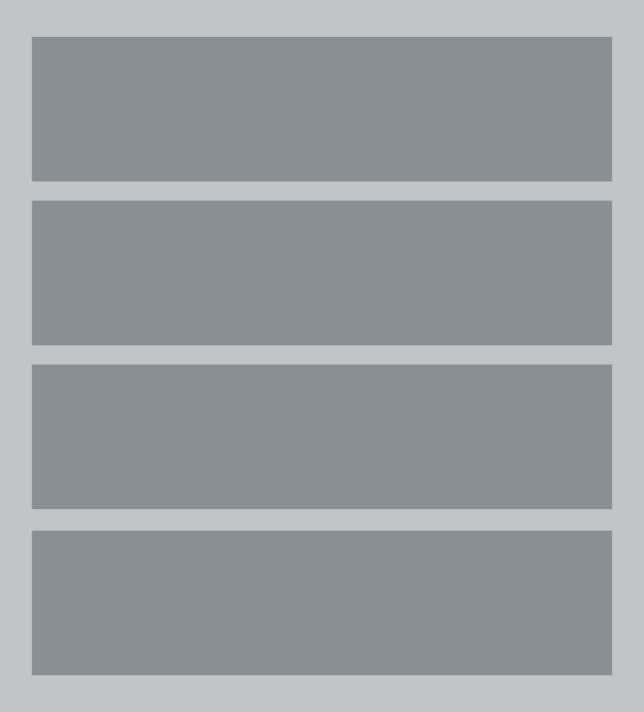
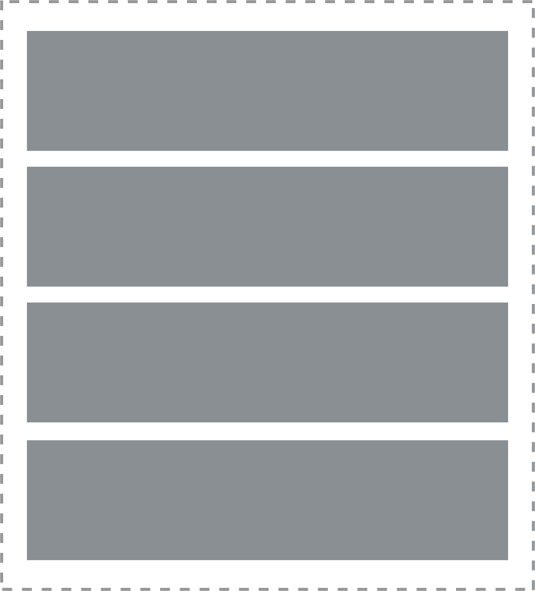
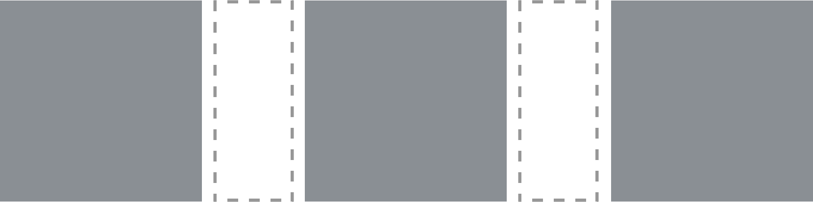
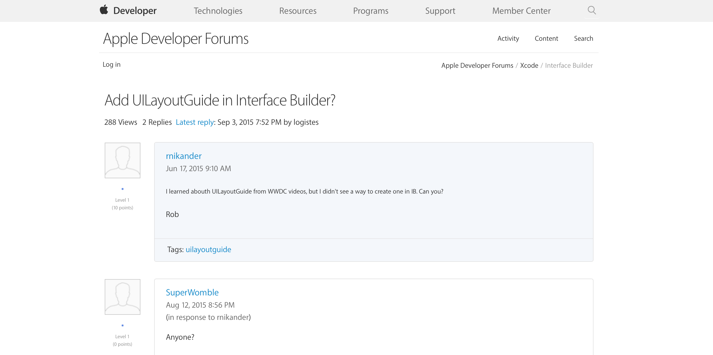
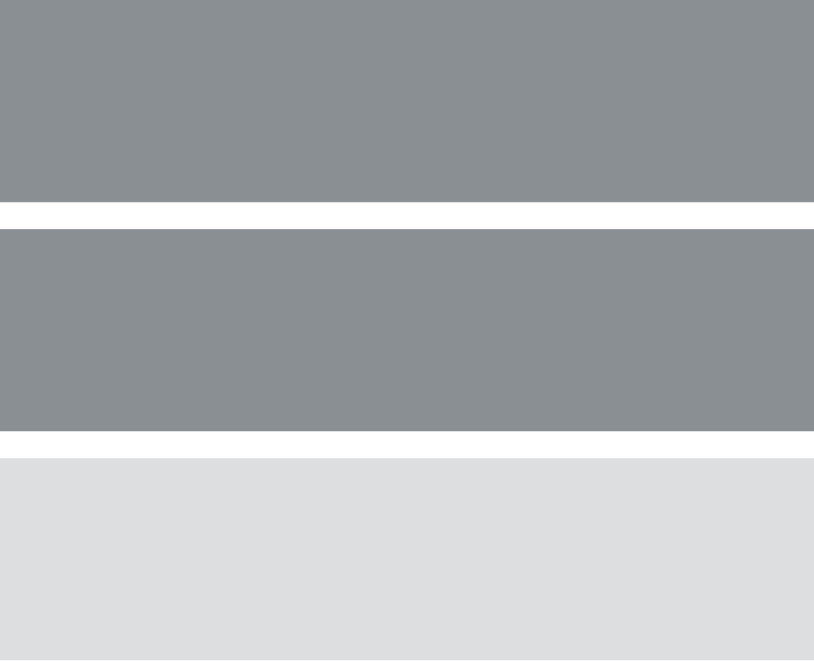
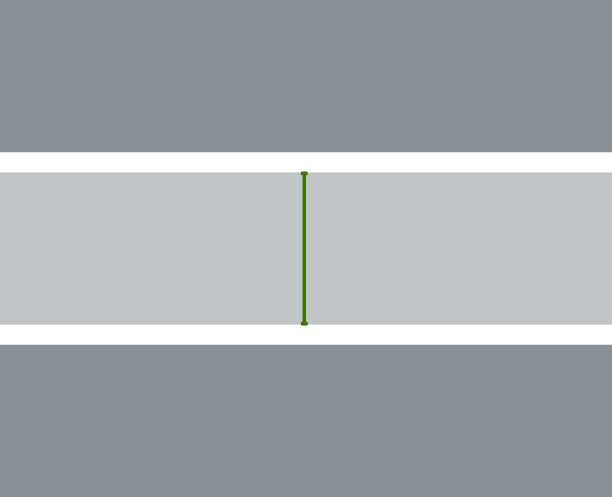
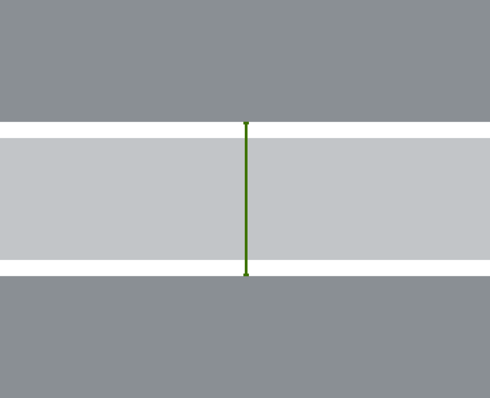

build-lists: true

# Clean Layout
## with :sparkles: iOS 9 :sparkles:
### @ayanonagon

---

# Hi, I’m **Ayaka**.
## @ayanonagon
### NSNorth 2016

---

 

---

# WWDC 2016

---

# :seedling: iOS 10 :seedling:

---

# :skull: ~~iOS 8~~ :skull:

---

# :sparkles: iOS 9 :sparkles:

---

> “But we still support iOS 7. 😭”
-- somebody in the audience

---

# iOS 9

* `3D Touch`
* `SFSafariViewController`
* `CoreSpotlight.framework`
* `Contacts.framework` & `ContactsUI.framework` (`ABAddressBook` :skull:)

---

## UIKit?

---

# UIKit

* Better `right-to-left` language support
* `UIUserNotificationAction` now has a `behavior` property
* `NSLayoutAnchor`
* `UILayoutGuide`
* `UIStackView`

---

# Today

* `NSLayoutAnchor`
* `UILayoutGuide`
* `UIStackView`

---

# Clean Layout
## with :sparkles: iOS 9 :sparkles:
### @ayanonagon

---

### Disclaimer: I do everything in code.

---

# :fire:

---

# [fit] Cleaner
# [fit] Safer
# [fit] Simpler

---

# [fit] Fun!

---

# VFL

```swift
"|-50-[rememberThis]-50-|"
"|-[omg]-[what]-[isThisView(>=20)]-|"
```

---

# V(isual) F(ormat) L(anguage)

```swift
"|-50-[rememberThis]-50-|"
"|-[omg]-[what]-[isThisView(>=20)]-|"
```

---

# V(ery) F(ragile) L(anguage)

```swift
"|-50-typos]-50-|"
"|-[omg]-typs]-[everywhere(>=20)-|"
```

---

# `NSLayoutConstraint.init`

```swift
NSLayoutConstraint(item: whyIsThis, 
              attribute: .Height, 
              relatedBy: .Equal,
                 toItem: soVerbose,
              attribute: .NotAnAttribute, 
             multiplier: 1.0,
               constant: 44.0)
```

---

```swift
NSLayoutConstraint(item: whyIsThis, 
              attribute: .Height, 
              relatedBy: .Equal,
                 toItem: soVerbose,
              attribute: .NotAnAttribute, 
             multiplier: 1.0,
               constant: 44.0)
```

```swift
"|-50-[rememberThis]-50-|"
"|-[omg]-[what]-[isThisView(>=20)]-|"
```

---

> “I want this view to be top-aligned with this other view.”

---

```swift
NSLayoutConstraint(item: view, 
              attribute: .Top, 
              relatedBy: .Equal,
                 toItem: otherView,
              attribute: .Top, 
             multiplier: 1.0,
               constant: 0.0)
```

^ It kind of sucks that we have to specify 1.0 for multiplier and 0.0 for constant here. Those both seem like reasonable defaults that we shouldn’t have to care about unless we want to tweak it.

^ This is exhausing you know?

---

## :sparkles: NSLayoutAnchor :sparkles:

---

```swift
NSLayoutConstraint(item: view, 
              attribute: .Top, 
              relatedBy: .Equal,
                 toItem: otherView,
              attribute: .Top, 
             multiplier: 1.0,
               constant: 0.0)
```

---

```swift
view.topAnchor.constraintEqualToAnchor(otherView.topAnchor)
```

---

```swift
NSLayoutConstraint(item: view,
              attribute: .Top,
              relatedBy: .Equal,
                 toItem: otherView,
              attribute: .Top,
             multiplier: 1.0,
               constant: 0.0)

// vs.

view.topAnchor.constraintEqualToAnchor(otherView.topAnchor)
```

---

> “I want this view to have a height of 44.”

---

```swift
NSLayoutConstraint(item: view,
              attribute: .Height,
              relatedBy: .Equal,
                 toItem: nil, // meh
              attribute: .NotAnAttribute, // wat
             multiplier: 1.0, // ugh
               constant: 44)
```

---

```swift
view.heightAnchor.constraintEqualToConstant(44)
```

---

```swift
NSLayoutConstraint(item: view,
              attribute: .Height,
              relatedBy: .Equal,
                 toItem: nil,
              attribute: .NotAnAttribute,
             multiplier: 1.0,
               constant: 44)

// vs.

view.heightAnchor.constraintEqualToConstant(44)
```

---

> “I want the top of this view to be aligned with the left side of this other view.”
-- me, on a sleepy day :sleepy:

---

```objc
[NSLayoutConstraint constraintWithItem:view
                             attribute:NSLayoutAttributeTop
                             relatedBy:NSLayoutRelationEqual 
                                toItem:otherView
                             attribute:NSLayoutAttributeLeft
                            multiplier:1.0
                              constant:0.0];
```

Doesn’t make sense, but compiles without warning. :scream:

---

```objc
[view.topAnchor constraintEqualToAnchor:otherView.leftAnchor];
```

Doesn’t make sense, so compiler emits a warning! :tada:

---


---


---

# Type Safety

* Dimension anchors (e.g. `heightAnchor`, `widthAnchor`) 
* X-axis anchors (e.g. `leadingAnchor`, `trailingAnchor`, `leftAnchor`, `rightAnchor`, `centerXAnchor`)
* Y-axis anchors (e.g. `topAnchor`, `bottomAnchor`, `centerYAnchor`, `firstBaselineAnchor`, `lastBaselineAnchor`)

---

## What happened to Swift? :fearful:

---

# What happened to Swift?

Doesn’t work for Swift because not all Objective-C generics have been brought over to Swift yet.

---

> “I want this view to be top-aligned with this other view.”

---

> “… and I also want some padding.”

---

## :sparkles: UILayoutGuide :sparkles:

---

# UIView
* `layoutMargins` (`UIEdgeInsets`)
* `layoutMarginsGuide` (`UILayoutGuide`) :sparkles: iOS 9 :sparkles:

---

> “I want this view to be top-aligned with this other view and I want some padding.”

--- 

```swift
let margins = otherView.layoutMarginsGuide
view.topAnchor.constraintEqualToAnchor(margins.topAnchor)
```

---

> “I want all of these views together to be centered in the superview.”

---

# Centering

1. Put all the views in a dummy container view.
2. Add the container view into the view hierarchy.
3. Center the container view.

---

# Problems

* Clutters the view hierarchy.
* The container view participates in the responder chain.

---

## :sparkles: UILayoutGuide (again!) :sparkles:

---

# UILayoutGuide

* Not a member of the view hierarchy.
* Does not participate in the responder chain.

---

# UIView Centering

1. Put all the views in a dummy container **view**.
2. Add the container **view** into the view hierarchy.
3. Center the container **view**.



---

# UILayoutGuide Centering

1. Put all the views in a container **layout guide**.
2. Add the **layout guide** to the view ~~hierarchy~~.
3. Center the **layout guide**.



---

```swift
let guide = UILayoutGuide()
guide.addSubview(view1)
guide.addSubview(view2)
// view3, …

view.addLayoutGuide(guide)
```

---

```swift
// Position the views in the layout guide.
NSLayoutConstraint.activateConstraints([
    view1.topAnchor.constraintEqualToAnchor(guide.topAnchor),
    view1.leadingAnchor.constraintEqualToAnchor(guide.leadingAnchor),
    // view2, view3, …
])

// Position the layout guide in the main view.
NSLayoutConstraint.activateConstraints([
    guide.centerXAnchor.constraintEqualToAnchor(view.centerXAnchor),
    guide.centerYAnchor.constraintEqualToAnchor(view.centerYAnchor),
])
```

---

# Spacing with UILayoutGuide



---



---

> “I want to stack three views vertically.”

---

> “… and I want to be able to show and hide the middle view.”
-- probably a designer

---


---



---

## Method 1

1. Make the height constraint of the middle view zero.
2. Deal with double padding issues.

---



---


---

## Method 2

1. Define a vertical constraint between the top most view and the bottom most view.
2. Shrink that constraint’s height to be the padding amount.
3. Hide the middle view.

---



---


---

## Method 3

1. Use a collection view to do your layout.
2. Update data source.

---

### What year is it?!
# (╯°□°）╯︵ ┻━┻

---

### Let’s use iOS 9.
# ┬──┬ ノ( ゜-゜ノ)

---

## :sparkles: UIStackView :sparkles:

---


---

> “I want to stack three views vertically and I want to be able to show and hide the middle view.”

---

```swift
let stackView = UIStackView()
stackView.axis = .Vertical

stackView.addArrangedSubview(view1)
stackView.addArrangedSubview(view2)
stackView.addArrangedSubview(view3)

view2.hidden = true // or false
```

---

# :eyes:

---


---


---


---


---


---


---

# TZStackView

* Compatible with iOS 7.x and iOS 8.x
* But no Storyboard support
* `:%s/TZStackView/UIStackView/g`

---

# Recap

* Cleaner and more type-safe layouts via `NSLayoutAnchor`
* Simpler view hierarchies and responder chain via `UILayoutGuide`
* Flexible (and easier to understand) layouts via `UIStackView`

---

# Thanks!
#### :skull: ~~iOS 8~~ :skull:

---

# Questions?
### ayaka@nonaka.me
### @ayanonagon

---

