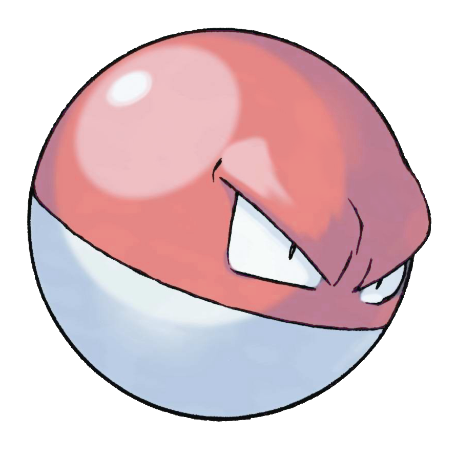
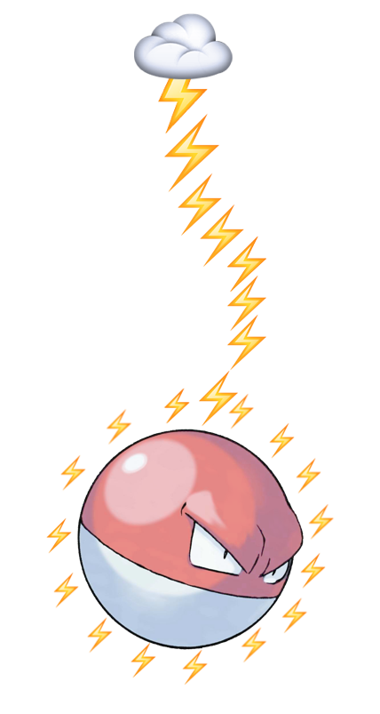
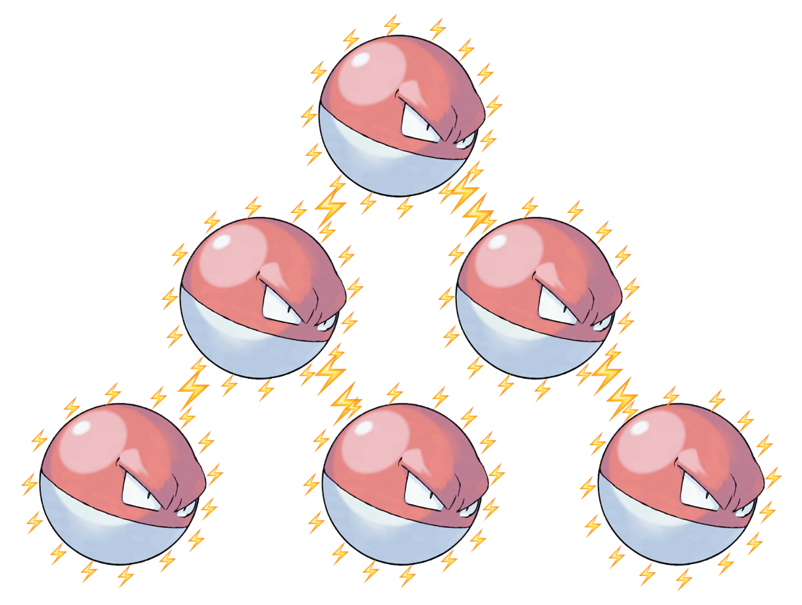

## 実践的
# Boundaries
## In Practice
#### try! Swift 2016

---


## Hi, I’m Ayaka.
### a.k.a. 彩花
#### @ayanonagon

^ Today I’m going to be presenting in both English and Japanese so if you’re wondering why you only understand every other sentence or why I’m saying everything twice, that’s why. However, for code, I’ll be explaining it in all English in the interest of time, and because Swift is a universal language.

^ 今日は日本語と英語両方でお話させていただきますので宜しくお願いします。しかし、Swiftコードの部分は共通語なので、英語で説明させて頂きます。

^ We have a lot of stuff to get through today, so let’s get started!

---


^ One of the first talks that I watched after Swift was released is this talk by Gary Berndhart called Boundaries. You might have heard this talk being referenced in other talks. Probably a functional programming talk.

^ Gary BerndhartさんのBoundariesの講演ご存知ですか？ ファンクショナルプログラミングの講演で良く参照される講演です。

^　In his talk, he presents a dichotomy of parts.

---

## Functional Core
## Imperative Shell

^ The functional core, and the imperative shell. The idea is that you can make the “core” of your components functional. That is, very easy to test (it’s all input and output with no side-effects!) and much easier to understand. But not everything that we have to deal with _is_ functional. Most of us have to deal with UIKit on a daily basis and that causes all sorts of side-effects. Even networking code. That’s inherently side-effect-y and stateful. But the idea is that we can pull this out into a separate layer. An “imperative shell”

^ この講演ではFunctional Core, Imperative Shell のコンセプトが紹介されます。このコンセプトはまずコードの芯をファンクショナルするということです。ファンクショナルにする事によって、副作用がなく、テストしやすいコードを書くことができます。しかし、全てをファンクショナルにするのは無理です。例えば、UIKitを使うと副作用だらけです。APIを使ったネットワークコードもそうです。しかし、その副作用だらけのコードはimperative shellに引っ張りだすことが出来る、ということです。

^ When I was learning about this idea, this is how I pictured things:

---

# Functional Core



^ イメージするとこんな感じです。 ファンクショナルで堅実な芯です。

^ This Voltorb here is a nice functional immutable specimen.

---

## App = Many Functional Cores


^ And if you extend this to an entire app architecture, there are multiple of them.

^ アプリのアーキテクチャーを全体的に見てみると、それが幾つもあります。

---

## with Imperative Shells


^ And each of those has an imperative shell around it.

^ そしてその一つ一つにimperative shellがあります。

^ The other day my team and I rewatched a talk titled Advanced iOS Application Architecture and Patterns from WWDC 2014.

^ 何週か前、私のチームはWWDC 2014 の　Advanced iOS Application Architecture and Patternsというトークを見直しました。

^　I loved this quote from Andy Matuschak:

---


### “All you really know maybe is that your taste is improving a lot faster than your ability.”
#### Andy Matuschak, Advanced iOS Application Architecture and Patterns (WWDC 2014)

^ 知っているのは自分の好みは自分の技術より速く上達しているという事だけかもしれない。

^ And that’s where I was with this whole functional core, imperative shell idea. I had a taste for it, and an intuition. But I wasn’t sure _how_ to use the ideas in practice.

^ 私もその立場にいました。「Functional Core, Imperative Shell」の理論は理解できたのですが、実際どの様にこのコンセプトを実用化できるのか良く分かりませんでした。

^ And that was fine! To learn something, we need to develop a taste first. Develop an intuition. _Then_ we can start applying the concept in practice when it seems like the time is right.

^ でも、それで良かったのです。新しいアイディアを身につけるときは,まず先に感覚を覚えて、後で「使えるかな？」って思った時に試してみれば良いのです。

^ And that’s what we’re going to talk about today.　今日はその話をさせていただきます。

---


## 実践的
# Boundaries
## In Practice
#### try! Swift 2016

^ We’re going to talk about boundaries in practice.実践的Boundariesです。As I’ve been writing more and more Swift, I started to see that the concept of “Functional Core, Imperative Shell” applies not just to functional programming, but also to good engineering in general. Today I’d like to show you some of these examples.

^ 毎日少しずつSwiftを書いているうちに、このコンセプトはファンクショナルプログラミングだけではなく、良いエンジニアリングに一般的に適用できるのが明らかになってきました。今日は幾つかの事例を紹介しながらお話しさせて頂きます。 

---

### 第一
## [fit] Immutable Core
## Network-y Shell
#### 不変な芯、ネットワークっぽい表面

^ The first one I want to talk about is the story of the Immutable Core and the Network-y Shell.

^ まず、第一。不変な芯とNetwork-ぽい表面の話。

---


^ The Venmo app looks something like this. Like any social app, there is a news feed where you can see your friends’ stories.

^ Venmoのアプリはこのようなものです。友達のストーリーがたくさんみれます。

---


^ You can tap into any one of them to see more details.

^ コメントとか見たかったら、好きなストーリーをセレクトしてみれます。

---

```swift
struct Story {
    let ID: String
    let title: String
    let message: String
    let sender: User
    let recipient: User
    let date: NSDate
    // ...
}
```

^ Each story is modeled something like this...

---

```swift
class StoriesViewController: UIViewController {
    let stories: [Story]
    // ...
}
```

^ This StoriesViewController class displays the list of stories.

---

```swift
class StoryDetailViewController: UIViewController {
    init(story: Story)
}
```

^ And when you tap into one of these stories, we show the StoryDetailViewController, which you can initialize with one of the stories from the StoriesViewController.

---

```swift
class StoryDetailViewController: UIViewController {
    private let titleView: StoryTitleView
    private let senderView: AvatarView
    private let recipientView: AvatarView
    private let dateLabel: DateLabel

    init(story: Story) {
        titleView = StoryTitleView(story: story)
        senderView = AvatarView(user: story.sender)
        recipientView = AvatarView(user: story.recipient)
        dateLabel = DateLabel(date: story.date)
    }

    // ...
}
```

^ It has a view for the title, sender, recipient, and date. And in the initializer, ...

^ I’m pretty happy with this. Everything is non-optional, and immutable. Immutable as a view controller can be. I’d say it’s a pretty "functional" core.

^ これ、全部non-optionalとimmutableだし、結構"functional"な芯だと思います。

---

^ But of course, soon after, we had to add a new feature on top of this. We had to implement push notifications and handle different URL schemes.

^ しかしもちろん、その結構直後に新しいフィーチャーをたさなくちゃいけませんですた。Push notificationのフィーチャーです。例えば、このようなURL schemeに対応して、StoryDetailViewControllerを表示したり。

`url_scheme://stories/12345`

---

```swift
class StoryDetailViewController: UIViewController {
    init(story: Story)
}
```

^ This is what the detail view controller looks like right now. We have a slight problem. We can’t use the story initializer anymore, because when we’re coming from a push notification, we only have the story ID.

---

```swift
class StoryDetailViewController: UIViewController {
    init(story: Story)
    init(storyID: String)
}
```

^ So the first thing that I tried was to add an initializer that takes a story ID.

---

```swift
class StoryDetailViewController: UIViewController {
    private let titleView: StoryTitleView
    private let senderView: AvatarView
    private let recipientView: AvatarView
    private let dateLabel: DateLabel

    init(story: Story) { /* Same as before 前と同じ */ }
    init(storyID: String) {
        // Hmmmmmmm.　これ何だろう？
    }
}
```

^ Then I started working on the implementation. initWithStory is still the same.

^ But initWithStory ID. How does this work? Unlike the case where we come from the StoriesViewController, which owns a list of stories, we don’t have a story object at hand to work with. And we can’t set any of the properties with out a story, so that’s a big problem.

---

```swift
class StoryDetailViewController: UIViewController {
    let storyID: String

    private var titleView: StoryTitleView?
    private var senderView: AvatarView?
    private var recipientView: AvatarView?
    private var dateLabel: DateLabel?

    init(story: Story) { /* Same as before 前と同じ */ }
    init(storyID: String) {
        self.storyID = storyID
        titleView = nil
        senderView = nil
        recipientView = nil
        dataLabel = nil
    }

    // Load everything from API in viewDidLoad?
    // viewDidLoadでAPIからロード？😨　
}

```

^ We could maybe load the story in viewDidLoad, but that means we need to make all of the properties optional and mutable so we can set them later.

^ I don’t know about you, but this code isn’t really suit my taste. Something feels wrong.

^ Before, everything was non-optional and immutable, so there was only one way to configure this. Now there are 2 to the 4th power, 16 ways to configure the properties. Actually, there are an infinite number of ways, since everything is mutable.

^ So I thought about it more, and this is what I came up with.

---

```swift
class StoryContainerViewController: UIViewController {
    let storyID: String

    init(storyID: String) {
        self.storyID = storyID
    }

    override func viewDidLoad() {
        client.showStory(ID: storyID) { result in
            switch result {
            case .Success(let story):
                let viewController = StoryDetailViewController(story: story)
                self.addChildViewController(viewController)
                self.view.addSubview(viewController.view)
                viewController.view.frame = view.bounds
                viewController.didMoveToParentViewController(self)
            case .Error(let error): // Show error　エラー表示
            }
        }
    }
}
```

^ We pulled out the networking code into an outer layer, a parent view controller. StoryContainerViewController.

^ You can initialize one of these with a story ID, and ...

---

```
url_scheme://stories/12345
```

```swift
StoryContainerViewController(storyID: "12345")
```

^ And now, if we get a URL like this, all we need to do is use the StoryContainerViewController.

---

```
url_scheme://stories/12345
```

^ So that handles the stories case. But what if we need to handle other URL’s?

---

```
url_scheme://stories/12345
url_scheme://users/007
```

^ What if we had to show a user’s profile from a URL?

---

```
url_scheme://stories/12345
url_scheme://users/007
url_scheme://messages/9876
```

^ What if we had to show a specific message from a URL?

^ What if we wanted to make it a little more generic?

^ To do this, we defined a new protocol, RemoteContentProviding.

---

```swift
protocol RemoteContentProviding {
    typealias Content

    func fetchContent(completion: Result<Content, Error> -> Void)
    func viewControllerForContent(content: Result<Content, Error>) -> UIViewController
}
```

^ This protocol has an associated type Content

^ And it specifies two things:

^ 1. How to fetch the content. This is most likely an API request.

^ and 2. How to take the content and convert it to a view controller for presentation.


---

```swift
class RemoteContentContainerViewController<T: RemoteContentProviding>: UIViewController {
    let provider: T

    init(provider: T) {
        self.remoteContentProvider = remoteContentProvider
        super.init(nibName: nil, bundle: nil)
    }

    override func viewDidLoad() {
        super.viewDidLoad()

        provider.fetchContent { content in
            let viewController = self.provider.viewControllerForContent(content)
            self.addChildViewController(viewController)
            self.view.addSubview(viewController.view)
            viewController.view.frame = view.bounds
            viewController.didMoveToParentViewController(self)
        }
    }
}
```

---

```swift
struct StoryProvider: RemoteContentProviding {
    let ID: String

    func fetchContent(completion: Result<Story, Error> -> Void) {
        client.showStory(ID: ID, completion: completion)
    }

    func viewControllerForContent(content: Result<Story, Error>) -> UIViewController {
        switch content {
        case .Success(let story): return StoryDetailViewController(story: story)
        case .Error(_): return ErrorViewController(title: "Could not find story.")
        }
    }
}
```

---

```
url_scheme://stories/12345
```

```swift
let provider = StoryProvider(ID: "12345")
RemoteContentContainerViewController(provider: provider)
```

---

```
url_scheme://users/007
```

```swift
let provider = UserProvider(ID: "007")
RemoteContentContainerViewController(provider: provider)
```

---

```
url_scheme://messages/9876
```

```swift
let provider = MessageProvider(ID: "9876")
RemoteContentContainerViewController(provider: provider)
```

^ By pulling out the stateful networking code into a container view controller, we were able to prevent our detail view controller from turning into something like this:

---

```swift
class StoryDetailViewController: UIViewController {
    let storyID: String

    private var titleView: StoryTitleView?
    private var senderView: AvatarView?
    private var recipientView: AvatarView?
    private var dateLabel: DateLabel?

    init(story: Story) { /* Same as before */ }
    init(storyID: String) {
        self.storyID = storyID
        titleView = nil
        senderView = nil
        recipientView = nil
        dataLabel = nil
    }

    // Load everything from API in viewDidLoad?
    // viewDidLoadでAPIからロード？😨
}
```

^ ... which if you visualize looks something like this:

---


^ Look there’s statefulness creeping into the core. The view controller is making an API request to the cloud!

^ and instead, we were able to maintain our immutable and, loosely speaking, "functional" core.

---

```swift
class StoryDetailViewController: UIViewController {
    private let titleView: StoryTitleView
    private let senderView: AvatarView
    private let recipientView: AvatarView
    private let dateLabel: DateLabel

    init(story: Story) {
        titleView = StoryTitleView(story: story)
        senderView = AvatarView(user: story.sender)
        recipientView = AvatarView(user: story.recipient)
        dateLabel = DateLabel(date: story.date)
    }

    // ...
}
```

^ All the properties are immutable and non-optional. You set them once, and you’re safe.

^ If you visual this, it looks something like this:

---



^ Much better.

---

### 第二
# [fit] Independent Cores
## Connective Shell
#### 独立した芯と繋げる表面

^ The next thing I want to share with you is the story of the Independent Cores and the Connective Shell.

^ 第二。独立した芯と繋げる表面。の話。

---


^ As a side-project, I’ve been working on an app that helps me learn Dutch.

^ 私は今サイドプロジェクトとしてオランダ語を勉強するアプリを開発しています。

^ One thing that I’ve loved about this process is that I get to experiment with a lot of ideas that I’ve been interested in, in this brand new codebase.

^ 新しいアプリを開発する事によって、色々な新しいアイディアを試す機会が増えました。その一つはコーデネーターです。

---

## Coordinators
#### Soroush Khanlou @ NSSpain

^ One of those ideas is the Coordinators design pattern. I first heard about it last year at a talk given by Soroush at NSSpain.

^ 去年、KhanlouさんのNSSpainの講演で初めて聞きました。

---

### View Controllers don’t know about other View Controllers

^ The main idea behind coordinators is that view controllers don’t know about other view controllers.

^ メインアイディアはview controllerは他のview controllerを知らないということです。

^ Let’s look at some code.

---

```swift
@UIApplicationMain
class AppDelegate: UIResponder, UIApplicationDelegate {

    var window: UIWindow?

    private lazy var applicationCoordinator: ApplicationCoordinator = {
        return ApplicationCoordinator(window: self.window!)
    }()

    func application(application: UIApplication, didFinishLaunchingWithOptions
        launchOptions: [NSObject: AnyObject]?) -> Bool {

        window = UIWindow(frame: UIScreen.mainScreen().bounds)
        applicationCoordinator.start()
        return true
    }
}
```

^ Let’s start with the App Delegate. By the way, can we please admire how tiny this is?

^ The App Delegate has a window as usual and ...

^ Before we take a look at the ApplicationCoordinator, let’s look at the Coordinator protocol.

---

```swift
protocol Coordinator {
    func start()
}
```

^ There are different ways to define a coordinator protocol, but the one I defined is very minimal.

^ All it requires is a start function to kick things off. So let’s look at what an implementation of a coordinator would look like.

---

```swift
class ApplicationCoordinator: Coordinator {

    let window: UIWindow
    let rootViewController = UITabBarController()

    let wordsNavigationController = UINavigationController()
    let phrasesNavigationController = UINavigationController()

    let wordsCoordinator: WordsCoordinator
    let phrasesCoordinator: PhrasesCoordinator

    init(window: UIWindow) {
        self.window = window
        let viewControllers = [wordsNavigationController, phrasesNavigationController]
        self.rootViewController.setViewControllers(viewControllers, animated: false)
        self.wordsCoordinator = WordsCoordinator(presenter: wordsNavigationController)
        self.phrasesCoordinator = PhrasesCoordinator(presenter: phrasesNavigationController)
    }

    func start() {
        window.rootViewController = rootViewController
        wordsCoordinator.start()
        phrasesCoordinator.start()
        window.makeKeyAndVisible()
    }
}
```

---

```swift
class WordsCoordinator: Coordinator {

    let presenter: UINavigationController

    private let listViewController: ListViewController<Word>
    private let dataSource: WordsDataSource

    init(presenter: UINavigationController) {
        self.presenter = presenter
        self.dataSource = WordsDataSource()
        self.listViewController = ListViewController<Word>()
        self.listViewController.title = "Words"
        self.listViewController.items = dataSource.words
        self.listViewController.configureCell = { cell, item in
            cell.item = item
        }
        self.listViewController.didSelectItem = { item in
            presenter.pushViewController(WordViewController(word: item), animated: true)
        }
    }

    func start() {
        presenter.pushViewController(listViewController, animated: false)
    }
}
```

---

```swift
class PhrasesCoordinator: Coordinator {

    let presenter: UINavigationController

    private let listViewController: ListViewController<Phrase>
    private let dataSource: PhrasesDataSource

    init(presenter: UINavigationController) {
        self.presenter = presenter
        self.dataSource = PhrasesDataSource()
        self.listViewController = ListViewController<Phrase>()
        self.listViewController.title = "Phrases"
        self.listViewController.items = dataSource.phrases
        self.listViewController.configureCell = { cell, item in
            cell.item = item
        }
        self.listViewController.didSelectItem = { item in
            presenter.pushViewController(PhraseViewController(phrase: item), animated: true)
        }
    }

    func start() {
        presenter.pushViewController(listViewController, animated: false)
    }
}
```

---

```
                ApplicationCoordinator
                    /          \
        WordsCoordinator   PhrasesCoordinator
```

^ When you use coordinators, the backbone of your application becomes a tree of coordinators.

^ Coordinatorをつかうと、アプリは木のような形になります。


---

```
                ApplicationCoordinator
                    /          \
        WordsCoordinator   PhrasesCoordinator
            /
    SearchCoordinator
```

^ If we wanted to add a feature that adds search functionality for words, we can create a new search coordinator and have the words coordinator manage that.

^ Search featureを足したかったら、簡単にできます。WordsCoordinatorにSearchCoordinatorをたすだけです。

---

```
                    ApplicationCoordinator
                        /           \
            DictionaryCoordinator   LoginCoordinator
                /          \
    WordsCoordinator   PhrasesCoordinator
        /
SearchCoordinator
```

^ If we wanted to add login functionality, that’s also easy. We can add a layer with a dictionary coordinator to manage the tabs, and a login coordinator to manage the login flow.

^　ログインも簡単。ApplicationCoordinatorにDictionaryCoordinatorとLoginCoordinatorを足します。

---


```
                    ApplicationCoordinator
                        /           \                 \
            DictionaryCoordinator  LoginCoordinator   SignUpCoordinator
                /          \
    WordsCoordinator   PhrasesCoordinator
        /
SearchCoordinator
```

^ And if we want to add a sign up flow, we can add a sign up coordinator that’s managed by the application coordinator. It’s pretty awesome to work with.

^ サインアップも同じ様に足せます。このCoordinatorパターン、かなり気に入っています。

---


^ This is what it would look like if we had an app that had view controllers present view controllers directly.

^ Coordinatorを使わないとこんなイメージです。

^ But by using coordinators, it looks more like this.

---



^ The View Controllers don’t know about each other and the coordinators handle all of the application flow.

^ そして、アプリのフローを全部コーデネーターに任せるとこんな感じです。

^ ... I’d like to stop here and talk a little bit about abstraction.

---

# 抽象化
## Abstraction

^ Abstration is one of the first concepts that we learn as software engineers. When I first learned about abstraction, I only thought about the interface. But as I’ve started embracing Swift features like value types I’ve noticed that abstraction applied just to the interface is not enough. In the first example with the story detail view, it wasn’t good enough to add a function like initWithStoryID. Sure it was a simple interface, but it introduced mutability into what would have otherwise been an immutable core.

^　抽象化（アブストラクション）とはソフトウェアエンジニアとして、結構初めに習うコンセプトです。抽象化と考えるとインターフェースが綺麗というイメージがありますよね。しかし、スイフトをたくさん書いている内、インターフェースでアブストクトするだけでは足りない、ということが明らかになってきました。


---

# 堅実
## Solid

^ And that’s why we need to look a little further. I’m finding that it’s not good enough to just abstract things through the interface. We need to think about what parts of the app make sense to be functional and immutable. In other words, solid.

^ まず、アーキテクチャーのどの部分がfunctional、immutable、堅実なパターンに適しているのかを把握するのが大切です。


---

# 流動的
## Fluid

^ And then we need to step back and think about how each of those components interact with inherently imperative and stateful things like networking. Things that are fluid. And things that are fluid aren’t necessarily bad. In fact, they give our apps movement and life.

^ そして同じように、どの部分がネットワークコードのように、imperative, stateful, 流動的なパターンに適しているのか把握します。


---

## 流動的 ↔ 堅実
## Fluid ↔ Solid


^ The key, which I think the most difficult part, is finding the balance... finding the boundary between what’s considered solid and what’s considered fluid.

^ 鍵は、堅実さと流動的さのバランスを見つけることだとおもいます。その Boundary(境界)を見つける事です。

^ And I think if we frame our thinking around this balance,

---

# 将来性
## Future Proof


^ we can write our apps that are more resilient, robust, and future proof.

^ そのバランスを見つけることで、より良い、より安全なそして将来性があるコードを書くことが出来ると思います

^ I hope that you learned some new ideas today that you can start using immediately, or at least got a TASTE of what you might want to try in the future.

^ 今日は何か新しい事習った！試してみよう！と思って頂ければ嬉しいです。

---

## Thank you
### ありがとう！


---

